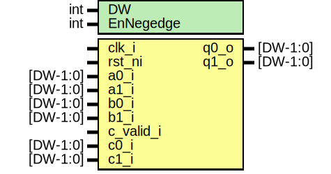

# Entity: prim_dom_and_2share

## Diagram

## Description

Copyright lowRISC contributors.
 Licensed under the Apache License, Version 2.0, see LICENSE for details.
 SPDX-License-Identifier: Apache-2.0
 Domain-Oriented Masking GF(2) Multiplier with 2-shares
 ref: Higher-Order Side-Channel Protected Implementations of Keccak
     https://eprint.iacr.org/2017/395.pdf
 q0 = a0 & b0 + (a0 & b1 + z)
 q1 = a1 & b1 + (a1 & b0 + z)
 () ==> registered
 all input should be stable for two clocks
 as the output is valid after a clock
 For z, it can use other slice from the state
 as it is fairly random w.r.t the current inputs.
 General formula of Q in the paper
 Qi = t{i,i} + Sig(j>i,d)(t{i,j}+Z{i+j*(j-1)/2}) + Sig(j<i,d)(t{i,j}+Z{j+i*(i-1)/2})
 for d=1 (NumShare 2 for first order protection)
 Q0 = t{0,0} + Sig(j>0,1)(t{0,j}+Z{j(j-1)/2}) + Sig(j<0,d)(..)
    = a0&b0  + (a0&b1 + z0                    + 0)
 Q1 = t{1,1} + sig(j>1,1)(...) + sig(j<1,1)(t{1,j} + Z{j})
    = a1&b1  + (0              + a1&b0 + z0)
 
## Generics

| Generic name | Type | Value | Description                        |
| ------------ | ---- | ----- | ---------------------------------- |
| DW           | int  | 64    | Input width                        |
| EnNegedge    | int  | 0     | Enable negedge of clk for register |
## Ports

| Port name | Direction | Type     | Description                  |
| --------- | --------- | -------- | ---------------------------- |
| clk_i     | input     |          |                              |
| rst_ni    | input     |          |                              |
| a0_i      | input     | [DW-1:0] | share0 of a                  |
| a1_i      | input     | [DW-1:0] | share1 of a                  |
| b0_i      | input     | [DW-1:0] | share0 of b                  |
| b1_i      | input     | [DW-1:0] | share1 of b                  |
| c_valid_i | input     |          | random number input validity |
| c0_i      | input     | [DW-1:0] | share0 of random number      |
| c1_i      | input     | [DW-1:0] | share1 of random number      |
| q0_o      | output    | [DW-1:0] | share0 of q                  |
| q1_o      | output    | [DW-1:0] | share1 of q                  |
## Signals

| Name   | Type           | Description |
| ------ | -------------- | ----------- |
| t0_d   | logic [DW-1:0] |             |
| t0_q   | logic [DW-1:0] |             |
| t1_d   | logic [DW-1:0] |             |
| t1_q   | logic [DW-1:0] |             |
| t_a0b1 | logic [DW-1:0] |             |
| t_a1b0 | logic [DW-1:0] |             |
| t_a0b0 | logic [DW-1:0] |             |
| t_a1b1 | logic [DW-1:0] |             |
