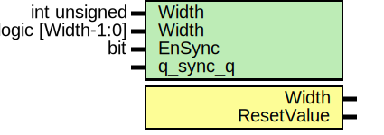

# Entity: prim_edge_detector

- **File**: prim_edge_detector.sv
## Diagram

## Description

 Copyright lowRISC contributors.
 Licensed under the Apache License, Version 2.0, see LICENSE for details.
 SPDX-License-Identifier: Apache-2.0

 Edge Detector

## Generics

| Generic name | Type              | Value             | Description                                                                                                                    |
| ------------ | ----------------- | ----------------- | ------------------------------------------------------------------------------------------------------------------------------ |
| Width        | int unsigned      | 1                 |                                                                                                                                |
| Width        | logic [Width-1:0] | '0                |                                                                                                                                |
| EnSync       | bit               | logic [Width-1:0] |  EnSync   Enable Synchronizer to the input signal.  It is assumed that the input signal is glitch free (registered input).  |
| q_sync_q     |                   | undefined         |                                                                                                                                |
## Ports

| Port name  | Direction | Type | Description |
| ---------- | --------- | ---- | ----------- |
| Width      | output    |      |             |
| ResetValue | output    |      |             |
## Signals

| Name     | Type | Description |
| -------- | ---- | ----------- |
| g_nosync | end  |             |
| g_nosync | end  |             |
## Processes
- unnamed: ( @(posedge clk_i or negedge rst_ni) )
  - **Type:** always_ff
