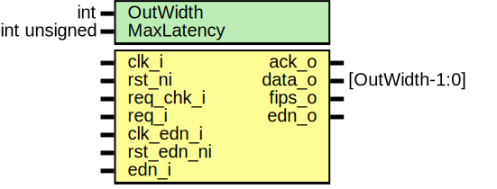

# Entity: prim_edn_req
## Diagram

## Description
Copyright lowRISC contributors.
 Licensed under the Apache License, Version 2.0, see LICENSE for details.
 SPDX-License-Identifier: Apache-2.0
 This module can be used as a "gadget" to adapt the native 32bit width of the EDN network
 locally to the width needed by the consuming logic. For example, if the local consumer
 needs 128bit, this module would request four 32 bit words from EDN and stack them accordingly.
 The module also uses a req/ack synchronizer to synchronize the EDN data over to the local
 clock domain. Note that this assumes that the EDN data bus remains stable between subsequent
 requests.
 
## Generics
| Generic name | Type | Value | Description                                                                                                   |
| ------------ | ---- | ----- | ------------------------------------------------------------------------------------------------------------- |
| OutWidth     | int  | 32    |                                                                                                               |
| EnReqStabA   | bit  | 1     | Non-functional parameter to switch on the request stability assertion. Used in submodule `prim_sync_reqack`.  |
## Ports
| Port name  | Direction | Type           | Description |
| ---------- | --------- | -------------- | ----------- |
| clk_i      | input     |                | Design side |
| rst_ni     | input     |                |             |
| req_i      | input     |                |             |
| ack_o      | output    |                |             |
| data_o     | output    | [OutWidth-1:0] |             |
| fips_o     | output    |                |             |
| clk_edn_i  | input     |                | EDN side    |
| rst_edn_ni | input     |                |             |
| edn_o      | output    |                |             |
| edn_i      | input     |                |             |
## Signals
| Name      | Type                                    | Description                                                                                                |
| --------- | --------------------------------------- | ---------------------------------------------------------------------------------------------------------- |
| word_req  | logic                                   | Stop requesting words from EDN once desired amount of data is available.                                   |
| word_ack  | logic                                   | Stop requesting words from EDN once desired amount of data is available.                                   |
| word_data | logic [edn_pkg::ENDPOINT_BUS_WIDTH-1:0] |                                                                                                            |
| word_fips | logic                                   |                                                                                                            |
| fips_d    | logic                                   | Need to track if any of the packed words has been generated with a pre-FIPS seed, i.e., has fips == 1'b0.  |
| fips_q    | logic                                   | Need to track if any of the packed words has been generated with a pre-FIPS seed, i.e., has fips == 1'b0.  |
## Constants
| Name      | Type | Value                                  | Description |
| --------- | ---- | -------------------------------------- | ----------- |
| SyncWidth | int  | $bits({edn_i.edn_fips, edn_i.edn_bus}) |             |
## Processes
- unnamed: _( @(posedge clk_i or negedge rst_ni) )_
keep

**Description**
keep

## Instantiations
- u_prim_sync_reqack_data: prim_sync_reqack_data
- u_prim_packer_fifo: prim_packer_fifo
