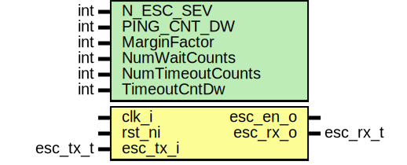

# Entity: prim_esc_receiver

## Diagram

## Description

Copyright lowRISC contributors.
 Licensed under the Apache License, Version 2.0, see LICENSE for details.
 SPDX-License-Identifier: Apache-2.0
 This module decodes escalation enable pulses that have been encoded using
 the prim_esc_sender module.
 The module supports in-band ping testing of the escalation
 wires. This is accomplished by the sender module that places a single-cycle,
 differentially encoded pulse on esc_p/n which will be interpreted as a ping
 request by the receiver module. The receiver module responds by sending back
 the response pattern "1010".
 Native escalation enable pulses are differentiated from ping
 requests by making sure that these pulses are always longer than 1 cycle.
 See also: prim_esc_sender, prim_diff_decode, alert_handler
 
## Generics

| Generic name     | Type | Value       | Description                                                                                                                                |
| ---------------- | ---- | ----------- | ------------------------------------------------------------------------------------------------------------------------------------------ |
| N_ESC_SEV        | int  | 4           | The number of escalation severities. Should be set to the Alert Handler's N_ESC_SEV when this primitive is instantiated.                   |
| PING_CNT_DW      | int  | 16          | The width of the Alert Handler's ping counter. Should be set to the Alert Handler's PING_CNT_DW when this primitive is instantiated.       |
| MarginFactor     | int  | 4           | Do NOT modify this counter value, when instantiating it in the design. It is only exposed to reduce the state space in the FPV testbench.  |
| NumWaitCounts    | int  | 2           |                                                                                                                                            |
| NumTimeoutCounts | int  | 2           |                                                                                                                                            |
| TimeoutCntDw     | int  | $clog2(Marg |                                                                                                                                            |
## Ports

| Port name | Direction | Type     | Description                 |
| --------- | --------- | -------- | --------------------------- |
| clk_i     | input     |          |                             |
| rst_ni    | input     |          |                             |
| esc_en_o  | output    |          | escalation enable           |
| esc_rx_o  | output    | esc_rx_t | escalation / ping response  |
| esc_tx_i  | input     | esc_tx_t | escalation output diff pair |
## Signals

| Name            | Type                          | Description |
| --------------- | ----------------------------- | ----------- |
| esc_level       | logic                         |             |
| esc_p           | logic                         |             |
| esc_n           | logic                         |             |
| sigint_detected | logic                         |             |
| ping_en         | logic                         |             |
| esc_en          | logic                         |             |
| cnt_q           | logic [1:0][TimeoutCntDw-1:0] |             |
| state_d         | state_e                       |             |
| state_q         | state_e                       |             |
| resp_pd         | logic                         |             |
| resp_pq         | logic                         |             |
| resp_nd         | logic                         |             |
| resp_nq         | logic                         |             |
| resp_p          | esc_tx_i                      |             |
## Constants

| Name             | Type | Value | Description                                                                                                                                |
| ---------------- | ---- | ----- | ------------------------------------------------------------------------------------------------------------------------------------------ |
| MarginFactor     | int  | 4     | Do NOT modify this counter value, when instantiating it in the design. It is only exposed to reduce the state space in the FPV testbench.  |
| NumWaitCounts    | int  | 2     |                                                                                                                                            |
| NumTimeoutCounts | int  | 2     |                                                                                                                                            |
## Types

| Name    | Type                                                      | Description |
| ------- | --------------------------------------------------------- | ----------- |
| state_e | enum logic [2:0] {Idle, Check, PingResp, EscResp, SigInt} |             |
## Processes
- p_fsm: (  )
- p_regs: ( @(posedge clk_i or negedge rst_ni) )
## Instantiations

- u_prim_buf_esc: prim_buf
**Description**
This prevents further tool optimizations of the differential signal.

- u_decode_esc: prim_diff_decode
- u_prim_generic_flop: prim_generic_flop
**Description**
This prevents further tool optimizations of the differential signal.

