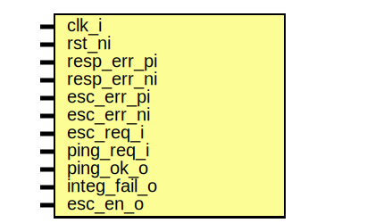

# Entity: prim_esc_rxtx_assert_fpv

- **File**: prim_esc_rxtx_assert_fpv.sv
## Diagram

## Description

 Copyright lowRISC contributors.
 Licensed under the Apache License, Version 2.0, see LICENSE for details.
 SPDX-License-Identifier: Apache-2.0

 Assertions for escalation sender/receiver pair. Intended to use with
 a formal tool.

## Ports

| Port name    | Direction | Type | Description                      |
| ------------ | --------- | ---- | -------------------------------- |
| clk_i        | input     |      |                                  |
| rst_ni       | input     |      |                                  |
| resp_err_pi  | input     |      |  for sigint error injection only |
| resp_err_ni  | input     |      |                                  |
| esc_err_pi   | input     |      |                                  |
| esc_err_ni   | input     |      |                                  |
| esc_req_i    | input     |      |  normal I/Os                     |
| ping_req_i   | input     |      |                                  |
| ping_ok_o    | input     |      |                                  |
| integ_fail_o | input     |      |                                  |
| esc_en_o     | input     |      |                                  |
## Signals

| Name          | Type   | Description                                           |
| ------------- | ------ | ----------------------------------------------------- |
| error_present | logic  |                                                       |
| error_d       | logic  |  tracks whether any error has been injected so far    |
| error_q       | logic  |  tracks whether any error has been injected so far    |
| esc_d         | logic  |  tracks whether escalation has been triggered so far  |
| esc_q         | logic  |  tracks whether escalation has been triggered so far  |
| ping_ok_o     | esc_re |                                                       |
| clk_i         | esc_re |                                                       |
| esc_req_i     | esc_re |                                                       |
## Processes
- p_error_reg: ( @(posedge clk_i or negedge rst_ni) )
  - **Type:** always_ff
- p_esc_reg: ( @(posedge clk_i or negedge rst_ni) )
  - **Type:** always_ff
