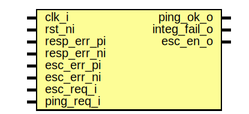

# Entity: prim_esc_rxtx_fpv

- **File**: prim_esc_rxtx_fpv.sv
## Diagram

## Description

Copyright lowRISC contributors.
 Licensed under the Apache License, Version 2.0, see LICENSE for details.
 SPDX-License-Identifier: Apache-2.0
 Testbench module for escalation sender/receiver pair. Intended to use with
 a formal tool.
 
## Ports

| Port name    | Direction | Type | Description                     |
| ------------ | --------- | ---- | ------------------------------- |
| clk_i        | input     |      |                                 |
| rst_ni       | input     |      |                                 |
| resp_err_pi  | input     |      | for sigint error injection only |
| resp_err_ni  | input     |      |                                 |
| esc_err_pi   | input     |      |                                 |
| esc_err_ni   | input     |      |                                 |
| esc_req_i    | input     |      | normal I/Os                     |
| ping_req_i   | input     |      |                                 |
| ping_ok_o    | output    |      |                                 |
| integ_fail_o | output    |      |                                 |
| esc_en_o     | output    |      |                                 |
## Signals

| Name       | Type     | Description |
| ---------- | -------- | ----------- |
| esc_rx_in  | esc_rx_t |             |
| esc_rx_out | esc_rx_t |             |
| esc_tx_in  | esc_tx_t |             |
| esc_tx_out | esc_tx_t |             |
## Instantiations

- u_prim_esc_sender: prim_esc_sender
- u_prim_esc_receiver: prim_esc_receiver
