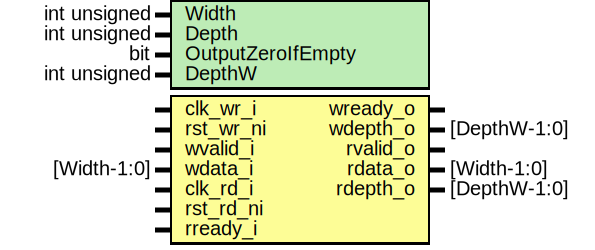

# Entity: prim_fifo_async

## Diagram

## Description

Copyright lowRISC contributors.
 Licensed under the Apache License, Version 2.0, see LICENSE for details.
 SPDX-License-Identifier: Apache-2.0
 Generic asynchronous fifo for use in a variety of devices.
 
## Generics

| Generic name      | Type         | Value           | Description                                |
| ----------------- | ------------ | --------------- | ------------------------------------------ |
| Width             | int unsigned | 16              |                                            |
| Depth             | int unsigned | 4               |                                            |
| OutputZeroIfEmpty | bit          | 1'b0            | if == 1 always output 0 when FIFO is empty |
| DepthW            | int unsigned | $clog2(Depth+1) | derived parameter representing [0..Depth]  |
## Ports

| Port name | Direction | Type         | Description |
| --------- | --------- | ------------ | ----------- |
| clk_wr_i  | input     |              | write port  |
| rst_wr_ni | input     |              |             |
| wvalid_i  | input     |              |             |
| wready_o  | output    |              |             |
| wdata_i   | input     | [Width-1:0]  |             |
| wdepth_o  | output    | [DepthW-1:0] |             |
| clk_rd_i  | input     |              | read port   |
| rst_rd_ni | input     |              |             |
| rvalid_o  | output    |              |             |
| rready_i  | input     |              |             |
| rdata_o   | output    | [Width-1:0]  |             |
| rdepth_o  | output    | [DepthW-1:0] |             |
## Signals

| Name                 | Type                  | Description |
| -------------------- | --------------------- | ----------- |
| fifo_wptr_q          | logic [PTR_WIDTH-1:0] |             |
| fifo_wptr_d          | logic [PTR_WIDTH-1:0] |             |
| fifo_rptr_q          | logic [PTR_WIDTH-1:0] |             |
| fifo_rptr_d          | logic [PTR_WIDTH-1:0] |             |
| fifo_wptr_sync_combi | logic [PTR_WIDTH-1:0] |             |
| fifo_rptr_sync_combi | logic [PTR_WIDTH-1:0] |             |
| fifo_wptr_gray_sync  | logic [PTR_WIDTH-1:0] |             |
| fifo_rptr_gray_sync  | logic [PTR_WIDTH-1:0] |             |
| fifo_rptr_sync_q     | logic [PTR_WIDTH-1:0] |             |
| fifo_wptr_gray_q     | logic [PTR_WIDTH-1:0] |             |
| fifo_wptr_gray_d     | logic [PTR_WIDTH-1:0] |             |
| fifo_rptr_gray_q     | logic [PTR_WIDTH-1:0] |             |
| fifo_rptr_gray_d     | logic [PTR_WIDTH-1:0] |             |
| fifo_incr_wptr       | logic                 |             |
| fifo_incr_rptr       | logic                 |             |
| full_wclk            | logic                 |             |
| full_rclk            | logic                 |             |
| empty_rclk           | logic                 |             |
| storage              | logic [Width-1:0]     |             |
| xor_mask             | logic [PTR_WIDTH-1:0] |             |
| rdata_int            | logic [Width-1:0]     |             |
## Constants

| Name      | Type         | Value           | Description                               |
| --------- | ------------ | --------------- | ----------------------------------------- |
| DepthW    | int unsigned | $clog2(Depth+1) | derived parameter representing [0..Depth] |
| PTRV_W    | int unsigned | $clog2(Depth)   |                                           |
| PTR_WIDTH | int unsigned | PTRV_W+1        |                                           |
## Processes
- unnamed: ( @(posedge clk_wr_i or negedge rst_wr_ni) )
- unnamed: ( @(posedge clk_wr_i or negedge rst_wr_ni) )
**Description**
gray-coded version

- unnamed: ( @(posedge clk_rd_i or negedge rst_rd_ni) )
- unnamed: ( @(posedge clk_rd_i or negedge rst_rd_ni) )
**Description**
gray-coded version

- unnamed: ( @(posedge clk_wr_i or negedge rst_wr_ni) )
**Description**
Registered version of synced read pointer

## Instantiations

- sync_wptr: prim_flop_2sync
**Description**
sync gray-coded pointer to read clk

- sync_rptr: prim_flop_2sync
**Description**
sync gray-coded pointer to write clk

