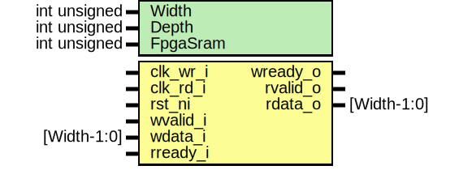

# Entity: prim_fifo_async_sram_adapter_fpv

- **File**: prim_fifo_async_sram_adapter_fpv.sv
## Diagram

## Description

 Copyright lowRISC contributors.
 Licensed under the Apache License, Version 2.0, see LICENSE for details.
 SPDX-License-Identifier: Apache-2.0

 Testbench module for prim_fifo_sram_async

## Generics

| Generic name | Type         | Value | Description    |
| ------------ | ------------ | ----- | -------------- |
| Width        | int unsigned | 32    |                |
| Depth        | int unsigned | 16    |                |
| FpgaSram     | int unsigned | 0     |  Use FF based  |
## Ports

| Port name | Direction | Type        | Description |
| --------- | --------- | ----------- | ----------- |
| clk_wr_i  | input     |             |             |
| clk_rd_i  | input     |             |             |
| rst_ni    | input     |             |             |
| wvalid_i  | input     |             |             |
| wready_o  | output    |             |             |
| wdata_i   | input     | [Width-1:0] |             |
| rvalid_o  | output    |             |             |
| rready_i  | input     |             |             |
| rdata_o   | output    | [Width-1:0] |             |
## Signals

| Name          | Type                      | Description |
| ------------- | ------------------------- | ----------- |
| w_sram_req    | logic                     |             |
| w_sram_gnt    | logic                     |             |
| w_sram_write  | logic                     |             |
| w_sram_addr   | logic [SramAw-1:0]        |             |
| w_sram_wdata  | logic [SramDw-1:0]        |             |
| w_sram_wmask  | logic [SramDw-1:0]        |             |
| w_sram_rvalid | logic                     | not used    |
| w_sram_rdata  | logic [SramDw-1:0]        | not used    |
| w_sram_rerror | logic [1:0]               | not used    |
| r_sram_req    | logic                     |             |
| r_sram_gnt    | logic                     |             |
| r_sram_write  | logic                     |             |
| r_sram_addr   | logic [SramAw-1:0]        |             |
| r_sram_wdata  | logic [SramDw-1:0]        | not used    |
| r_sram_wmask  | logic [SramDw-1:0]        | not used    |
| r_sram_rvalid | logic                     |             |
| r_sram_rdata  | logic [SramDw-1:0]        |             |
| r_sram_rerror | logic [1:0]               |             |
| storage       | logic [Width-1:0]         |             |
| rdata         | logic [Width-1:0]         |             |
| wptr          | logic [$clog2(Depth)-1:0] |             |
| rptr          | logic [$clog2(Depth)-1:0] |             |
| wack          | logic                     |             |
| rack          | logic                     |             |
## Constants

| Name         | Type               | Value | Description |
| ------------ | ------------------ | ----- | ----------- |
| SramAw       | int unsigned       | 7     |             |
| SramDw       | int unsigned       | 32    |             |
| SramBaseAddr | logic [SramAw-1:0] | 30    |             |
## Processes
- unnamed: ( @(posedge clk_wr_i) )
  - **Type:** always_ff
- unnamed: ( @(posedge clk_rd_i) )
  - **Type:** always_ff
- unnamed: ( @(posedge clk_wr_i or negedge rst_ni) )
  - **Type:** always_ff
- unnamed: ( @(posedge clk_rd_i or negedge rst_ni) )
  - **Type:** always_ff
- unnamed: ( @(posedge clk_wr_i or negedge rst_ni) )
  - **Type:** always_ff
## Instantiations

- dut: prim_fifo_async_sram_adapter
