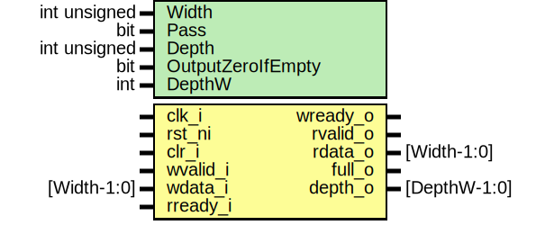

# Entity: prim_fifo_sync

## Diagram

## Description

Copyright lowRISC contributors.
 Licensed under the Apache License, Version 2.0, see LICENSE for details.
 SPDX-License-Identifier: Apache-2.0
 Generic synchronous fifo for use in a variety of devices.
 
## Generics

| Generic name      | Type         | Value                        | Description                                       |
| ----------------- | ------------ | ---------------------------- | ------------------------------------------------- |
| Width             | int unsigned | 16                           |                                                   |
| Pass              | bit          | 1'b1                         | if == 1 allow requests to pass through empty FIFO |
| Depth             | int unsigned | 4                            |                                                   |
| OutputZeroIfEmpty | bit          | 1'b1                         | if == 1 always output 0 when FIFO is empty        |
| DepthW            | int          | prim_util_pkg::vbits(Depth+1 | derived parameter                                 |
## Ports

| Port name | Direction | Type         | Description                    |
| --------- | --------- | ------------ | ------------------------------ |
| clk_i     | input     |              |                                |
| rst_ni    | input     |              |                                |
| clr_i     | input     |              | synchronous clear / flush port |
| wvalid_i  | input     |              | write port                     |
| wready_o  | output    |              |                                |
| wdata_i   | input     | [Width-1:0]  |                                |
| rvalid_o  | output    |              | read port                      |
| rready_i  | input     |              |                                |
| rdata_o   | output    | [Width-1:0]  |                                |
| full_o    | output    |              | occupancy                      |
| depth_o   | output    | [DepthW-1:0] |                                |
## Constants

| Name   | Type | Value                        | Description        |
| ------ | ---- | ---------------------------- | ------------------ |
| DepthW | int  | prim_util_pkg::vbits(Depth+1 | derived parameter  |
