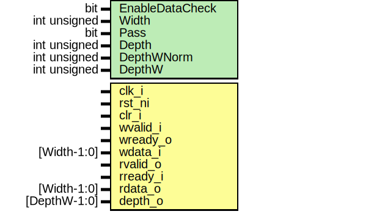

# Entity: prim_fifo_sync_assert_fpv
## Diagram

## Description
Copyright lowRISC contributors.
 Licensed under the Apache License, Version 2.0, see LICENSE for details.
 SPDX-License-Identifier: Apache-2.0
 Assertions for prim_fifo_sync.
 Intended to be used with a formal tool.
 
## Generics
| Generic name    | Type         | Value           | Description                       |
| --------------- | ------------ | --------------- | --------------------------------- |
| EnableDataCheck | bit          | 1'b1            | can be desabled for deeper FIFOs  |
| Width           | int unsigned | 16              |                                   |
| Pass            | bit          | 1'b1            |                                   |
| Depth           | int unsigned | 4               |                                   |
| DepthWNorm      | int unsigned | $clog2(Depth+1) |                                   |
| DepthW          | int unsigned | DepthWNorm      |                                   |
## Ports
| Port name | Direction | Type         | Description |
| --------- | --------- | ------------ | ----------- |
| clk_i     | input     |              |             |
| rst_ni    | input     |              |             |
| clr_i     | input     |              |             |
| wvalid_i  | input     |              |             |
| wready_o  | input     |              |             |
| wdata_i   | input     | [Width-1:0]  |             |
| rvalid_o  | input     |              |             |
| rready_i  | input     |              |             |
| rdata_o   | input     | [Width-1:0]  |             |
| depth_o   | input     | [DepthW-1:0] |             |
## Constants
| Name       | Type         | Value           | Description |
| ---------- | ------------ | --------------- | ----------- |
| DepthWNorm | int unsigned | $clog2(Depth+1) |             |
| DepthW     | int unsigned | DepthWNorm      |             |
