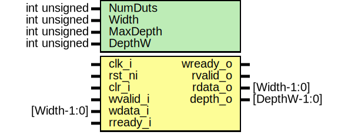

# Entity: prim_fifo_sync_fpv

- **File**: prim_fifo_sync_fpv.sv
## Diagram

## Description

 Copyright lowRISC contributors.
 Licensed under the Apache License, Version 2.0, see LICENSE for details.
 SPDX-License-Identifier: Apache-2.0

 Testbench module for prim_fifo_sync.
 Intended to be used with a formal tool.

 This formal testbench instantiates a set of differently parameterized FIFOs:

  - a depth 0 pass through FIFO
  - depth 1, 7, 8, 15, 16 pass through FIFOs
  - depth 1, 7, 8, 15, 16 non-pass through FIFOs

 Data/depth value checks are enabled up to depth 8 in order to constrain the
 runtime.

## Generics

| Generic name | Type         | Value              | Description                                         |
| ------------ | ------------ | ------------------ | --------------------------------------------------- |
| NumDuts      | int unsigned | 11                 |  number of DUTs instantiated in this FPV testbench  |
| Width        | int unsigned | 4                  |  fifo params                                        |
| MaxDepth     | int unsigned | 16                 |  max depth used in this destbench                   |
| DepthW       | int unsigned | $clog2(MaxDepth+1) |                                                     |
## Ports

| Port name | Direction | Type         | Description |
| --------- | --------- | ------------ | ----------- |
| clk_i     | input     |              |             |
| rst_ni    | input     |              |             |
| clr_i     | input     |              |             |
| wvalid_i  | input     |              |             |
| wready_o  | output    |              |             |
| wdata_i   | input     | [Width-1:0]  |             |
| rvalid_o  | output    |              |             |
| rready_i  | input     |              |             |
| rdata_o   | output    | [Width-1:0]  |             |
| depth_o   | output    | [DepthW-1:0] |             |
## Constants

| Name   | Type         | Value              | Description |
| ------ | ------------ | ------------------ | ----------- |
| DepthW | int unsigned | $clog2(MaxDepth+1) |             |
## Instantiations

- i_nopass1: prim_fifo_sync
**Description**
 need to instantiate by hand since bind statements inside
 generate blocks are currently not supported
//////////////////
 non-pass FIFOs //
//////////////////

- i_nopass7: prim_fifo_sync
- i_nopass8: prim_fifo_sync
- i_nopass15: prim_fifo_sync
- i_nopass16: prim_fifo_sync
- i_pass0: prim_fifo_sync
**Description**
//////////////
 pass FIFOs //
//////////////
 depth_o-zero is per definition a pass-through FIFO

- i_pass1: prim_fifo_sync
- i_pass7: prim_fifo_sync
- i_pass8: prim_fifo_sync
- i_pass15: prim_fifo_sync
- i_pass16: prim_fifo_sync
