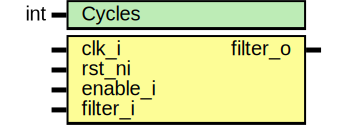

# Entity: prim_filter

## Diagram

## Description

Copyright lowRISC contributors.
 Licensed under the Apache License, Version 2.0, see LICENSE for details.
 SPDX-License-Identifier: Apache-2.0
 Primitive input filter, with enable.  Configurable number of cycles.
 when in reset, stored vector is zero
 when enable is false, output is input
 when enable is true, output is stored value,
   new input must be opposite value from stored value for
   #Cycles before switching to new value.
 
## Generics

| Generic name | Type | Value | Description |
| ------------ | ---- | ----- | ----------- |
| Cycles       | int  | 4     |             |
## Ports

| Port name | Direction | Type | Description |
| --------- | --------- | ---- | ----------- |
| clk_i     | input     |      |             |
| rst_ni    | input     |      |             |
| enable_i  | input     |      |             |
| filter_i  | input     |      |             |
| filter_o  | output    |      |             |
## Signals

| Name                       | Type               | Description |
| -------------------------- | ------------------ | ----------- |
| stored_vector_q            | logic [Cycles-1:0] |             |
| stored_vector_d            | logic [Cycles-1:0] |             |
| stored_value_q             | logic              |             |
| update_stored_value        | logic              |             |
| unused_stored_vector_q_msb | logic              |             |
## Processes
- unnamed: ( @(posedge clk_i or negedge rst_ni) )
- unnamed: ( @(posedge clk_i or negedge rst_ni) )
