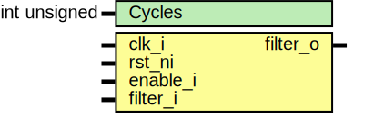

# Entity: prim_filter_ctr

## Diagram

## Description

Copyright lowRISC contributors.
 Licensed under the Apache License, Version 2.0, see LICENSE for details.
 SPDX-License-Identifier: Apache-2.0
 Primitive counter-based input filter, with enable.
 Configurable number of cycles. Cheaper version of filter for
 large values of #Cycles
 when in reset, stored value is zero
 when enable is false, output is input
 when enable is true, output is stored value,
   new input must be opposite value from stored value for
   #Cycles before switching to new value.
 
## Generics

| Generic name | Type         | Value | Description |
| ------------ | ------------ | ----- | ----------- |
| Cycles       | int unsigned | 4     |             |
## Ports

| Port name | Direction | Type | Description |
| --------- | --------- | ---- | ----------- |
| clk_i     | input     |      |             |
| rst_ni    | input     |      |             |
| enable_i  | input     |      |             |
| filter_i  | input     |      |             |
| filter_o  | output    |      |             |
## Signals

| Name                | Type  | Description |
| ------------------- | ----- | ----------- |
| filter_q            | logic |             |
| stored_value_q      | logic |             |
| update_stored_value | logic |             |
## Constants

| Name      | Type                  | Value                 | Description |
| --------- | --------------------- | --------------------- | ----------- |
| CTR_WIDTH | int unsigned          | $clog2(Cycles)        |             |
| CYCLESM1  | logic [CTR_WIDTH-1:0] | logic [CTR_WIDTH-1:0] |             |
## Processes
- unnamed: ( @(posedge clk_i or negedge rst_ni) )
- unnamed: ( @(posedge clk_i or negedge rst_ni) )
- unnamed: ( @(posedge clk_i or negedge rst_ni) )
