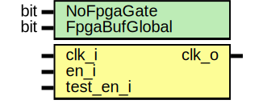

# Entity: prim_generic_clock_gating

- **File**: prim_generic_clock_gating.sv
## Diagram

## Description

 Copyright lowRISC contributors.
 Licensed under the Apache License, Version 2.0, see LICENSE for details.
 SPDX-License-Identifier: Apache-2.0

 Common Library: Clock Gating cell

 The logic assumes that en_i is synchronized (so the instantiation site might need to put a
 synchronizer before en_i).

## Generics

| Generic name  | Type | Value | Description                                 |
| ------------- | ---- | ----- | ------------------------------------------- |
| NoFpgaGate    | bit  | 1'b0  |  this parameter has no function in generic  |
| FpgaBufGlobal | bit  | 1'b1  |  this parameter has no function in generic  |
## Ports

| Port name | Direction | Type | Description |
| --------- | --------- | ---- | ----------- |
| clk_i     | input     |      |             |
| en_i      | input     |      |             |
| test_en_i | input     |      |             |
| clk_o     | output    |      |             |
## Signals

| Name     | Type  | Description                |
| -------- | ----- | -------------------------- |
| en_latch | logic | verilator clock_enable */  |
## Processes
- unnamed: (  )
  - **Type:** always_latch
