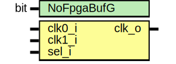

# Entity: prim_generic_clock_mux2
## Diagram

## Description
Copyright lowRISC contributors.
 Licensed under the Apache License, Version 2.0, see LICENSE for details.
 SPDX-License-Identifier: Apache-2.0
 
## Generics
| Generic name | Type | Value | Description                                            |
| ------------ | ---- | ----- | ------------------------------------------------------ |
| NoFpgaBufG   | bit  | 1'b0  | this parameter serves no function in the generic model |
## Ports
| Port name | Direction | Type | Description |
| --------- | --------- | ---- | ----------- |
| clk0_i    | input     |      |             |
| clk1_i    | input     |      |             |
| sel_i     | input     |      |             |
| clk_o     | output    |      |             |
