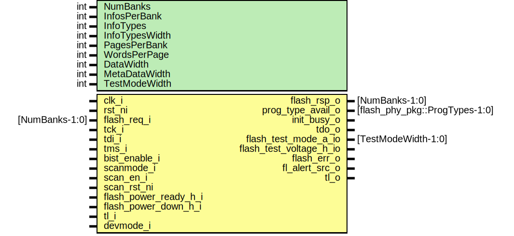

# Entity: prim_generic_flash

## Diagram

## Description

Copyright lowRISC contributors.
 Licensed under the Apache License, Version 2.0, see LICENSE for details.
 SPDX-License-Identifier: Apache-2.0
 Overall flash wrapper
 
## Generics

| Generic name   | Type | Value | Description          |
| -------------- | ---- | ----- | -------------------- |
| NumBanks       | int  | 2     | number of banks      |
| InfosPerBank   | int  | 1     | info pages per bank  |
| InfoTypes      | int  | 1     | different info types |
| InfoTypesWidth | int  | 1     | different info types |
| PagesPerBank   | int  | 256   | data pages per bank  |
| WordsPerPage   | int  | 256   | words per page       |
| DataWidth      | int  | 32    | bits per word        |
| MetaDataWidth  | int  | 12    | metadata such as ECC |
| TestModeWidth  | int  | 2     |                      |
## Ports

| Port name               | Direction | Type                           | Description |
| ----------------------- | --------- | ------------------------------ | ----------- |
| clk_i                   | input     |                                |             |
| rst_ni                  | input     |                                |             |
| flash_req_i             | input     | [NumBanks-1:0]                 |             |
| flash_rsp_o             | output    | [NumBanks-1:0]                 |             |
| prog_type_avail_o       | output    | [flash_phy_pkg::ProgTypes-1:0] |             |
| init_busy_o             | output    |                                |             |
| tck_i                   | input     |                                |             |
| tdi_i                   | input     |                                |             |
| tms_i                   | input     |                                |             |
| tdo_o                   | output    |                                |             |
| bist_enable_i           | input     |                                |             |
| scanmode_i              | input     |                                |             |
| scan_en_i               | input     |                                |             |
| scan_rst_ni             | input     |                                |             |
| flash_power_ready_h_i   | input     |                                |             |
| flash_power_down_h_i    | input     |                                |             |
| flash_test_mode_a_io    | inout     | [TestModeWidth-1:0]            |             |
| flash_test_voltage_h_io | inout     |                                |             |
| flash_err_o             | output    |                                |             |
| fl_alert_src_o          | output    |                                |             |
| tl_i                    | input     |                                |             |
| tl_o                    | output    |                                |             |
| devmode_i               | input     |                                |             |
## Signals

| Name                      | Type                      | Description                                |
| ------------------------- | ------------------------- | ------------------------------------------ |
| unused_devmode            | logic                     |                                            |
| init                      | logic                     | convert this into a tlul write later       |
| init_busy                 | logic [NumBanks-1:0]      |                                            |
| unused_scanmode           | lc_ctrl_pkg::lc_tx_t      |                                            |
| unused_scan_en            | logic                     |                                            |
| unused_scan_rst_n         | logic                     |                                            |
| unused_flash_test_mode    | logic [TestModeWidth-1:0] |                                            |
| unused_flash_test_voltage | logic                     |                                            |
| unused_tck                | logic                     |                                            |
| unused_tdi                | logic                     |                                            |
| unused_tms                | logic                     |                                            |
| cfg_req                   | logic                     | fake memory used to emulate configuration  |
| cfg_we                    | logic                     |                                            |
| cfg_addr                  | logic [CfgAddrWidth-1:0]  |                                            |
| cfg_wdata                 | logic [31:0]              |                                            |
| cfg_rvalid                | logic                     |                                            |
| cfg_rdata                 | logic [31:0]              |                                            |
| unused_bist_enable        | lc_ctrl_pkg::lc_tx_t      |                                            |
## Constants

| Name         | Type | Value           | Description |
| ------------ | ---- | --------------- | ----------- |
| CfgRegs      | int  | 21              |             |
| CfgAddrWidth | int  | $clog2(CfgRegs) |             |
## Processes
- unnamed: ( @(posedge clk_i or negedge rst_ni) )
## Instantiations

- u_cfg: tlul_adapter_sram
- u_cfg_ram: prim_ram_1p
