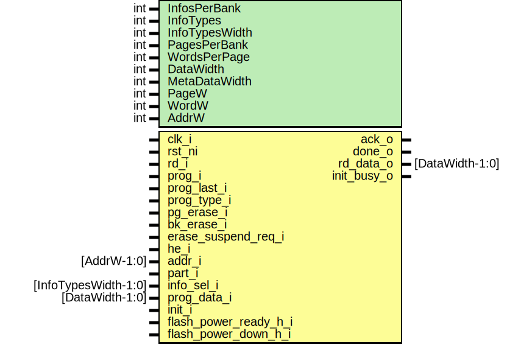

# Entity: prim_generic_flash_bank
## Diagram

## Description
Copyright lowRISC contributors.
 Licensed under the Apache License, Version 2.0, see LICENSE for details.
 SPDX-License-Identifier: Apache-2.0
 Emulate a single generic flash bank
 
## Generics
| Generic name   | Type | Value                | Description                                             |
| -------------- | ---- | -------------------- | ------------------------------------------------------- |
| InfosPerBank   | int  | 1                    | info pages per bank                                     |
| InfoTypes      | int  | 1                    | different info types                                    |
| InfoTypesWidth | int  | 1                    | different info types                                    |
| PagesPerBank   | int  | 256                  | data pages per bank                                     |
| WordsPerPage   | int  | 256                  | words per page                                          |
| DataWidth      | int  | 32                   | bits per word                                           |
| MetaDataWidth  | int  | 12                   | this is a temporary parameter to work around ECC issues |
| PageW          | int  | $clog2(PagesPerBank) | Derived parameters                                      |
| WordW          | int  | $clog2(WordsPerPage) |                                                         |
| AddrW          | int  | PageW + WordW        |                                                         |
## Ports
| Port name             | Direction | Type                 | Description                                          |
| --------------------- | --------- | -------------------- | ---------------------------------------------------- |
| clk_i                 | input     |                      |                                                      |
| rst_ni                | input     |                      |                                                      |
| rd_i                  | input     |                      |                                                      |
| prog_i                | input     |                      |                                                      |
| prog_last_i           | input     |                      |                                                      |
| prog_type_i           | input     |                      | the generic model does not make use of program types |
| pg_erase_i            | input     |                      |                                                      |
| bk_erase_i            | input     |                      |                                                      |
| erase_suspend_req_i   | input     |                      |                                                      |
| he_i                  | input     |                      |                                                      |
| addr_i                | input     | [AddrW-1:0]          |                                                      |
| part_i                | input     |                      |                                                      |
| info_sel_i            | input     | [InfoTypesWidth-1:0] |                                                      |
| prog_data_i           | input     | [DataWidth-1:0]      |                                                      |
| ack_o                 | output    |                      |                                                      |
| done_o                | output    |                      |                                                      |
| rd_data_o             | output    | [DataWidth-1:0]      |                                                      |
| init_i                | input     |                      |                                                      |
| init_busy_o           | output    |                      |                                                      |
| flash_power_ready_h_i | input     |                      |                                                      |
| flash_power_down_h_i  | input     |                      |                                                      |
## Signals
| Name              | Type                                     | Description                                                                                                                                                                                                                                                                                                                                                                                                                                                                                                                                |
| ----------------- | ---------------------------------------- | ------------------------------------------------------------------------------------------------------------------------------------------------------------------------------------------------------------------------------------------------------------------------------------------------------------------------------------------------------------------------------------------------------------------------------------------------------------------------------------------------------------------------------------------ |
| st_q              | state_e                                  |                                                                                                                                                                                                                                                                                                                                                                                                                                                                                                                                            |
| st_d              | state_e                                  |                                                                                                                                                                                                                                                                                                                                                                                                                                                                                                                                            |
| time_cnt          | logic [31:0]                             |                                                                                                                                                                                                                                                                                                                                                                                                                                                                                                                                            |
| index_cnt         | logic [31:0]                             |                                                                                                                                                                                                                                                                                                                                                                                                                                                                                                                                            |
| time_cnt_inc      | logic                                    |                                                                                                                                                                                                                                                                                                                                                                                                                                                                                                                                            |
| time_cnt_clr      | logic                                    |                                                                                                                                                                                                                                                                                                                                                                                                                                                                                                                                            |
| time_cnt_set1     | logic                                    |                                                                                                                                                                                                                                                                                                                                                                                                                                                                                                                                            |
| index_cnt_inc     | logic                                    |                                                                                                                                                                                                                                                                                                                                                                                                                                                                                                                                            |
| index_cnt_clr     | logic                                    |                                                                                                                                                                                                                                                                                                                                                                                                                                                                                                                                            |
| index_limit_q     | logic [31:0]                             |                                                                                                                                                                                                                                                                                                                                                                                                                                                                                                                                            |
| index_limit_d     | logic [31:0]                             |                                                                                                                                                                                                                                                                                                                                                                                                                                                                                                                                            |
| time_limit_q      | logic [31:0]                             |                                                                                                                                                                                                                                                                                                                                                                                                                                                                                                                                            |
| time_limit_d      | logic [31:0]                             |                                                                                                                                                                                                                                                                                                                                                                                                                                                                                                                                            |
| prog_pend_q       | logic                                    |                                                                                                                                                                                                                                                                                                                                                                                                                                                                                                                                            |
| prog_pend_d       | logic                                    |                                                                                                                                                                                                                                                                                                                                                                                                                                                                                                                                            |
| mem_req           | logic                                    |                                                                                                                                                                                                                                                                                                                                                                                                                                                                                                                                            |
| mem_wr            | logic                                    |                                                                                                                                                                                                                                                                                                                                                                                                                                                                                                                                            |
| mem_wdata         | logic [DataWidth-1:0]                    |                                                                                                                                                                                                                                                                                                                                                                                                                                                                                                                                            |
| mem_addr          | logic [AddrW-1:0]                        |                                                                                                                                                                                                                                                                                                                                                                                                                                                                                                                                            |
| mem_part          | flash_ctrl_pkg::flash_part_e             |                                                                                                                                                                                                                                                                                                                                                                                                                                                                                                                                            |
| mem_info_sel      | logic [InfoTypesWidth-1:0]               |                                                                                                                                                                                                                                                                                                                                                                                                                                                                                                                                            |
| cmd_d             | cmd_payload_t                            |                                                                                                                                                                                                                                                                                                                                                                                                                                                                                                                                            |
| cmd_q             | cmd_payload_t                            |                                                                                                                                                                                                                                                                                                                                                                                                                                                                                                                                            |
| cmd_valid         | logic                                    |                                                                                                                                                                                                                                                                                                                                                                                                                                                                                                                                            |
| pop_cmd           | logic                                    |                                                                                                                                                                                                                                                                                                                                                                                                                                                                                                                                            |
| mem_rd_q          | logic                                    |                                                                                                                                                                                                                                                                                                                                                                                                                                                                                                                                            |
| mem_rd_d          | logic                                    |                                                                                                                                                                                                                                                                                                                                                                                                                                                                                                                                            |
| wvalid            | logic                                    | for read transactions, in order to reduce latency, the command fifo is popped early (before done_o).  This is to ensure that when the current transaction is complete, during the same cycle a new read can be issued. As a result, the command is popped immediately after the read is issued, rather than waiting for the read to be completed.  The same restrictions are not necessary for program / erase, which do not have the same performance requirements. when the flash is going through init, do not accept any transactions  |
| ack               | logic                                    |                                                                                                                                                                                                                                                                                                                                                                                                                                                                                                                                            |
| rd_req            | logic                                    |                                                                                                                                                                                                                                                                                                                                                                                                                                                                                                                                            |
| prog_req          | logic                                    |                                                                                                                                                                                                                                                                                                                                                                                                                                                                                                                                            |
| pg_erase_req      | logic                                    |                                                                                                                                                                                                                                                                                                                                                                                                                                                                                                                                            |
| bk_erase_req      | logic                                    |                                                                                                                                                                                                                                                                                                                                                                                                                                                                                                                                            |
| rd_data_q         | logic [DataWidth-1:0]                    | latch read data from emulated memories the cycle after a read                                                                                                                                                                                                                                                                                                                                                                                                                                                                              |
| rd_data_d         | logic [DataWidth-1:0]                    | latch read data from emulated memories the cycle after a read                                                                                                                                                                                                                                                                                                                                                                                                                                                                              |
| rd_part_q         | flash_ctrl_pkg::flash_part_e             | latch partiton being read since the command fifo is popped early                                                                                                                                                                                                                                                                                                                                                                                                                                                                           |
| info_sel_q        | logic [InfoTypesWidth-1:0]               |                                                                                                                                                                                                                                                                                                                                                                                                                                                                                                                                            |
| rd_data_main      | logic [DataWidth-1:0]                    |                                                                                                                                                                                                                                                                                                                                                                                                                                                                                                                                            |
| rd_data_info      | logic [DataWidth-1:0]                    |                                                                                                                                                                                                                                                                                                                                                                                                                                                                                                                                            |
| rd_nom_data_main  | logic [MemWidth-1:0]                     |                                                                                                                                                                                                                                                                                                                                                                                                                                                                                                                                            |
| rd_meta_data_main | logic [MetaDataWidth-1:0]                |                                                                                                                                                                                                                                                                                                                                                                                                                                                                                                                                            |
| rd_nom_data_info  | logic [InfoTypes-1:0][MemWidth-1:0]      |                                                                                                                                                                                                                                                                                                                                                                                                                                                                                                                                            |
| rd_meta_data_info | logic [InfoTypes-1:0][MetaDataWidth-1:0] |                                                                                                                                                                                                                                                                                                                                                                                                                                                                                                                                            |
| unused_prog_type  | flash_ctrl_pkg::flash_prog_e             |                                                                                                                                                                                                                                                                                                                                                                                                                                                                                                                                            |
| unused_he         | logic                                    |                                                                                                                                                                                                                                                                                                                                                                                                                                                                                                                                            |
## Constants
| Name             | Type | Value                       | Description                  |
| ---------------- | ---- | --------------------------- | ---------------------------- |
| PageW            | int  | $clog2(PagesPerBank)        | Derived parameters           |
| WordW            | int  | $clog2(WordsPerPage)        |                              |
| AddrW            | int  | PageW + WordW               |                              |
| ReadCycles       | int  | 1                           | Emulated flash macro values  |
| ProgCycles       | int  | 50                          |                              |
| PgEraseCycles    | int  | 200                         |                              |
| BkEraseCycles    | int  | 2000                        |                              |
| InitCycles       | int  | 100                         |                              |
| WordsPerBank     | int  | PagesPerBank * WordsPerPage | Locally derived values       |
| WordsPerInfoBank | int  | InfosPerBank * WordsPerPage |                              |
| InfoAddrW        | int  | $clog2(WordsPerInfoBank)    |                              |
| MemWidth         | int  | DataWidth - MetaDataWidth   | always_comb                  |
## Types
| Name          | Type                                                                                                                                                                                                                                                                                                                                                                                                                                               | Description                                                                    |
| ------------- | -------------------------------------------------------------------------------------------------------------------------------------------------------------------------------------------------------------------------------------------------------------------------------------------------------------------------------------------------------------------------------------------------------------------------------------------------- | ------------------------------------------------------------------------------ |
| state_e       | enum logic [2:0] {     StReset    = 'h0,     StInit     = 'h1,     StIdle     = 'h2,     StRead     = 'h3,     StProg     = 'h4,     StErase    = 'h5   }                                                                                                                                                                                                                                                                                          |                                                                                |
| cmd_payload_t | struct packed {     logic                        rd;     logic                        prog;     logic                        prog_last;     flash_ctrl_pkg::flash_prog_e prog_type;     logic                        pg_erase;     logic                        bk_erase;     logic [AddrW-1:0]            addr;     flash_ctrl_pkg::flash_part_e part;     logic [InfoTypesWidth-1:0]   info_sel;     logic [DataWidth-1:0]        prog_data;   } | insert a fifo here to break the large fanout from inputs to memories on reads  |
## Processes
- unnamed: _( @(posedge clk_i or negedge rst_ni) )_

- unnamed: _( @(posedge clk_i or negedge rst_ni) )_

- unnamed: _( @(posedge clk_i or negedge rst_ni) )_

- unnamed: _( @(posedge clk_i or negedge rst_ni) )_

- unnamed: _( @(posedge clk_i or negedge rst_ni) )_
prog_pend_q is necessary to emulate flash behavior that a bit written to 0 cannot be written
back to 1 without an erase

**Description**
prog_pend_q is necessary to emulate flash behavior that a bit written to 0 cannot be written
back to 1 without an erase

- unnamed: _(  )_

## Instantiations
- u_mem_meta: prim_ram_1p
