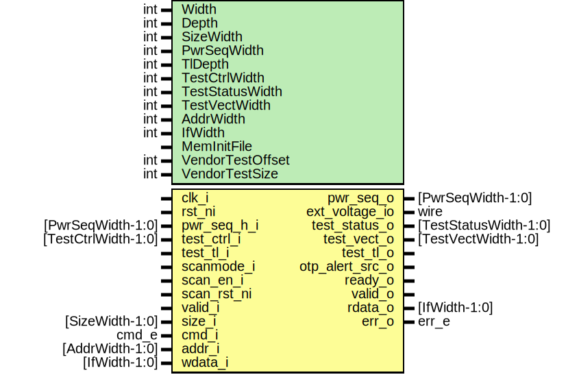

# Entity: prim_generic_otp

- **File**: prim_generic_otp.sv
## Diagram

## Description

Copyright lowRISC contributors.
 Licensed under the Apache License, Version 2.0, see LICENSE for details.
 SPDX-License-Identifier: Apache-2.0
 
## Generics

| Generic name  | Type | Value                       | Description                                                                                                     |
| ------------- | ---- | --------------------------- | --------------------------------------------------------------------------------------------------------------- |
| Width         | int  | 16                          | Native OTP word size. This determines the size_i granule.                                                       |
| Depth         | int  | 1024                        |                                                                                                                 |
| SizeWidth     | int  | 2                           | This determines the maximum number of native words that can be transferred accross the interface in one cycle.  |
| PwrSeqWidth   | int  | 2                           | Width of the power sequencing signal.                                                                           |
| TlDepth       | int  | 16                          | Number of Test TL-UL words                                                                                      |
| TestCtrlWidth | int  | 8                           | Width of vendor-specific test control signal                                                                    |
| AddrWidth     | int  | prim_util_pkg::vbits(Depth) | Derived parameters                                                                                              |
| IfWidth       | int  | 2**SizeWidth*Width          |                                                                                                                 |
| MemInitFile   |      | ""                          | VMEM file to initialize the memory with                                                                         |
## Ports

| Port name       | Direction | Type                | Description                                           |
| --------------- | --------- | ------------------- | ----------------------------------------------------- |
| clk_i           | input     |                     |                                                       |
| rst_ni          | input     |                     |                                                       |
| pwr_seq_o       | output    | [PwrSeqWidth-1:0]   | Macro-specific power sequencing signals to/from AST   |
| pwr_seq_h_i     | input     | [PwrSeqWidth-1:0]   |                                                       |
| ext_voltage_io  | inout     | wire                | External programming voltage                          |
| test_ctrl_i     | input     | [TestCtrlWidth-1:0] | Test interface                                        |
| test_tl_i       | input     |                     |                                                       |
| test_tl_o       | output    |                     |                                                       |
| scanmode_i      | input     |                     | Scan Mode input                                       |
| scan_en_i       | input     |                     | Scan Shift                                            |
| scan_rst_ni     | input     |                     | Scan Reset                                            |
| otp_alert_src_o | output    |                     | Alert indication                                      |
| ready_o         | output    |                     | Ready valid handshake for read/write command          |
| valid_i         | input     |                     |                                                       |
| size_i          | input     | [SizeWidth-1:0]     | #(Native words)-1, e.g. size == 0 for 1 native word.  |
| cmd_i           | input     | cmd_e               | 00: read command, 01: write command, 11: init command |
| addr_i          | input     | [AddrWidth-1:0]     |                                                       |
| wdata_i         | input     | [IfWidth-1:0]       |                                                       |
| valid_o         | output    |                     | Response channel                                      |
| rdata_o         | output    | [IfWidth-1:0]       |                                                       |
| err_o           | output    | err_e               |                                                       |
## Signals

| Name               | Type                                         | Description                                                                                                                |
| ------------------ | -------------------------------------------- | -------------------------------------------------------------------------------------------------------------------------- |
| unused_pwr_seq_h   | logic [PwrSeqWidth-1:0]                      | Not supported in open-source emulation model.                                                                              |
| unused_ext_voltage | wire                                         |                                                                                                                            |
| unused_test_ctrl_i | logic                                        |                                                                                                                            |
| unused_scan        | logic                                        |                                                                                                                            |
| tlul_req           | logic                                        |                                                                                                                            |
| tlul_rvalid_q      | logic                                        |                                                                                                                            |
| tlul_wren          | logic                                        |                                                                                                                            |
| tlul_regfile_q     | logic [TlDepth-1:0][31:0]                    |                                                                                                                            |
| tlul_wdata         | logic [31:0]                                 |                                                                                                                            |
| tlul_rdata_q       | logic [31:0]                                 |                                                                                                                            |
| tlul_addr          | logic [TlAddrWidth-1:0]                      |                                                                                                                            |
| state_d            | state_e                                      |                                                                                                                            |
| state_q            | state_e                                      |                                                                                                                            |
| err_d              | err_e                                        |                                                                                                                            |
| err_q              | err_e                                        |                                                                                                                            |
| valid_d            | logic                                        |                                                                                                                            |
| valid_q            | logic                                        |                                                                                                                            |
| req                | logic                                        |                                                                                                                            |
| wren               | logic                                        |                                                                                                                            |
| rvalid             | logic                                        |                                                                                                                            |
| rerror             | logic [1:0]                                  |                                                                                                                            |
| addr_q             | logic [AddrWidth-1:0]                        |                                                                                                                            |
| size_q             | logic [SizeWidth-1:0]                        |                                                                                                                            |
| cnt_d              | logic [SizeWidth-1:0]                        |                                                                                                                            |
| cnt_q              | logic [SizeWidth-1:0]                        |                                                                                                                            |
| cnt_clr            | logic                                        |                                                                                                                            |
| cnt_en             | logic                                        |                                                                                                                            |
| read_ecc_on        | logic                                        |                                                                                                                            |
| wdata_inconsistent | logic                                        |                                                                                                                            |
| addr               | logic [AddrWidth-1:0]                        |                                                                                                                            |
| rdata_corr         | logic [Width-1:0]                            |                                                                                                                            |
| rdata_d            | logic [Width+EccWidth-1:0]                   |                                                                                                                            |
| wdata_ecc          | logic [Width+EccWidth-1:0]                   |                                                                                                                            |
| rdata_ecc          | logic [Width+EccWidth-1:0]                   |                                                                                                                            |
| wdata_rmw          | logic [Width+EccWidth-1:0]                   |                                                                                                                            |
| wdata_q            | logic [2**SizeWidth-1:0][Width-1:0]          |                                                                                                                            |
| rdata_reshaped     | logic [2**SizeWidth-1:0][Width-1:0]          |                                                                                                                            |
| rdata_q            | logic [2**SizeWidth-1:0][Width+EccWidth-1:0] |                                                                                                                            |
| state_raw_q        | logic [StateWidth-1:0]                       | This primitive is used to place a size-only constraint on the flops in order to prevent FSM state encoding optimizations.  |
## Constants

| Name        | Type | Value                         | Description                                                                                                                                              |
| ----------- | ---- | ----------------------------- | -------------------------------------------------------------------------------------------------------------------------------------------------------- |
| AddrWidth   | int  | prim_util_pkg::vbits(Depth)   | Derived parameters                                                                                                                                       |
| IfWidth     | int  | 2**SizeWidth*Width            |                                                                                                                                                          |
| EccWidth    | int  | 6                             | This is only restricted by the supported ECC poly further below, and is straightforward to extend, if needed.                                            |
| TlAddrWidth | int  | prim_util_pkg::vbits(TlDepth) | Put down a register that can be used to test the TL interface. TODO: this emulation may need to be adjusted, once closed source wrapper is implemented.  |
| StateWidth  | int  | 10                            |                                                                                                                                                          |
## Types

| Name    | Type                                                                                                                                                                                                                                                                                                                                                                                                                                                                                                                                                                                                                     | Description |
| ------- | ------------------------------------------------------------------------------------------------------------------------------------------------------------------------------------------------------------------------------------------------------------------------------------------------------------------------------------------------------------------------------------------------------------------------------------------------------------------------------------------------------------------------------------------------------------------------------------------------------------------------ | ----------- |
| state_e | enum logic [StateWidth-1:0] {      ResetSt      = 10'b1100000011,      InitSt       = 10'b1100110100,      IdleSt       = 10'b1010111010,      ReadSt       = 10'b0011100000,      ReadWaitSt   = 10'b1001011111,      WriteCheckSt = 10'b0111010101,      WriteWaitSt  = 10'b0000001100,      WriteSt      = 10'b0110101111   } |             |
## Processes
- p_tlul_testreg: ( @(posedge clk_i or negedge rst_ni) )
- p_fsm: (  )
- p_output_map: (  )
**Description**
Output data without ECC bits.

- p_regs: ( @(posedge clk_i or negedge rst_ni) )
## Instantiations

- u_tlul_adapter_sram: tlul_adapter_sram
- u_enc: prim_secded_hamming_22_16_enc
**Description**
Use a standard Hamming ECC for OTP.

- u_dec: prim_secded_hamming_22_16_dec
- u_prim_ram_1p_adv: prim_ram_1p_adv
- u_state_regs: prim_flop
