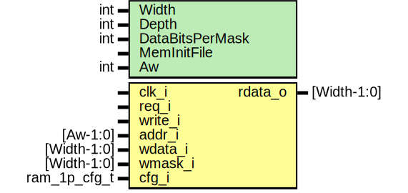

# Entity: prim_generic_ram_1p
## Diagram

## Description
Copyright lowRISC contributors.
 Licensed under the Apache License, Version 2.0, see LICENSE for details.
 SPDX-License-Identifier: Apache-2.0
 Synchronous single-port SRAM model
 
## Generics
| Generic name    | Type | Value         | Description                               |
| --------------- | ---- | ------------- | ----------------------------------------- |
| Width           | int  | 32            | bit                                       |
| Depth           | int  | 128           |                                           |
| DataBitsPerMask | int  | 1             | Number of data bits per bit of write mask |
| MemInitFile     |      | ""            | VMEM file to initialize the memory with   |
| Aw              | int  | $clog2(Depth) | derived parameter                         |
## Ports
| Port name | Direction | Type         | Description                                                |
| --------- | --------- | ------------ | ---------------------------------------------------------- |
| clk_i     | input     |              |                                                            |
| req_i     | input     |              |                                                            |
| write_i   | input     |              |                                                            |
| addr_i    | input     | [Aw-1:0]     |                                                            |
| wdata_i   | input     | [Width-1:0]  |                                                            |
| wmask_i   | input     | [Width-1:0]  |                                                            |
| rdata_o   | output    | [Width-1:0]  | Read data. Data is returned one cycle after req_i is high. |
| cfg_i     | input     | ram_1p_cfg_t |                                                            |
## Signals
| Name       | Type                  | Description |
| ---------- | --------------------- | ----------- |
| unused_cfg | logic                 |             |
| mem        | logic [Width-1:0]     |             |
| wmask      | logic [MaskWidth-1:0] |             |
## Constants
| Name      | Type | Value                   | Description                                                                                                 |
| --------- | ---- | ----------------------- | ----------------------------------------------------------------------------------------------------------- |
| Aw        | int  | $clog2(Depth)           | derived parameter                                                                                           |
| MaskWidth | int  | Width / DataBitsPerMask | Width of internal write mask. Note wmask_i input into the module is always assumed to be the full bit mask  |
## Processes
- unnamed: _( @(posedge clk_i) )_
using always instead of always_ff to avoid 'ICPD  - illegal combination of drivers' error
thrown when using $readmemh system task to backdoor load an image

**Description**
using always instead of always_ff to avoid 'ICPD  - illegal combination of drivers' error
thrown when using $readmemh system task to backdoor load an image

