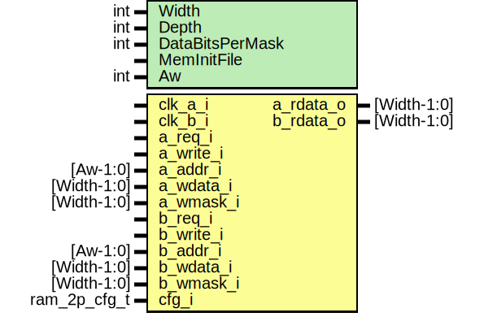

# Entity: prim_generic_ram_2p

- **File**: prim_generic_ram_2p.sv
## Diagram

## Description

 Copyright lowRISC contributors.
 Licensed under the Apache License, Version 2.0, see LICENSE for details.
 SPDX-License-Identifier: Apache-2.0

 Synchronous dual-port SRAM register model
   This module is for simulation and small size SRAM.
   Implementing ECC should be done inside wrapper not this model.

## Generics

| Generic name    | Type | Value         | Description                                 |
| --------------- | ---- | ------------- | ------------------------------------------- |
| Width           | int  | 32            |  bit                                        |
| Depth           | int  | 128           |                                             |
| DataBitsPerMask | int  | 1             |  Number of data bits per bit of write mask  |
| MemInitFile     |      | ""            |  VMEM file to initialize the memory with    |
| Aw              | int  | $clog2(Depth) |  derived parameter                          |
## Ports

| Port name | Direction | Type         | Description |
| --------- | --------- | ------------ | ----------- |
| clk_a_i   | input     |              |             |
| clk_b_i   | input     |              |             |
| a_req_i   | input     |              |             |
| a_write_i | input     |              |             |
| a_addr_i  | input     | [Aw-1:0]     |             |
| a_wdata_i | input     | [Width-1:0]  |             |
| a_wmask_i | input     | [Width-1:0]  |             |
| a_rdata_o | output    | [Width-1:0]  |             |
| b_req_i   | input     |              |             |
| b_write_i | input     |              |             |
| b_addr_i  | input     | [Aw-1:0]     |             |
| b_wdata_i | input     | [Width-1:0]  |             |
| b_wmask_i | input     | [Width-1:0]  |             |
| b_rdata_o | output    | [Width-1:0]  |             |
| cfg_i     | input     | ram_2p_cfg_t |             |
## Signals

| Name       | Type                  | Description |
| ---------- | --------------------- | ----------- |
| unused_cfg | logic                 |             |
| mem        | logic [Width-1:0]     |             |
| a_wmask    | logic [MaskWidth-1:0] |             |
| b_wmask    | logic [MaskWidth-1:0] |             |
| mem        | end                   |             |
| end        | end                   |             |
| MaskWidth  | i                     |             |
| end        | end                   |             |
| else       | end                   |             |
| b_rdata_o  | begin                 |             |
## Constants

| Name      | Type | Value                   | Description                                                                                                      |
| --------- | ---- | ----------------------- | ---------------------------------------------------------------------------------------------------------------- |
| Aw        | int  | $clog2(Depth)           | derived parameter                                                                                                |
| MaskWidth | int  | Width / DataBitsPerMask |  Width of internal write mask. Note *_wmask_i input into the module is always assumed  to be the full bit mask.  |
