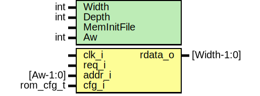

# Entity: prim_generic_rom

- **File**: prim_generic_rom.sv
## Diagram

## Description

Copyright lowRISC contributors.
 Licensed under the Apache License, Version 2.0, see LICENSE for details.
 SPDX-License-Identifier: Apache-2.0
 
## Generics

| Generic name | Type | Value         | Description                             |
| ------------ | ---- | ------------- | --------------------------------------- |
| Width        | int  | 32            |                                         |
| Depth        | int  | 2048          | 8kB default                             |
| MemInitFile  |      | ""            | VMEM file to initialize the memory with |
| Aw           | int  | $clog2(Depth) |                                         |
## Ports

| Port name | Direction | Type        | Description |
| --------- | --------- | ----------- | ----------- |
| clk_i     | input     |             |             |
| req_i     | input     |             |             |
| addr_i    | input     | [Aw-1:0]    |             |
| rdata_o   | output    | [Width-1:0] |             |
| cfg_i     | input     | rom_cfg_t   |             |
## Signals

| Name       | Type              | Description |
| ---------- | ----------------- | ----------- |
| unused_cfg | logic             |             |
| mem        | logic [Width-1:0] |             |
## Constants

| Name | Type | Value         | Description |
| ---- | ---- | ------------- | ----------- |
| Aw   | int  | $clog2(Depth) |             |
## Processes
- unnamed: ( @(posedge clk_i) )
