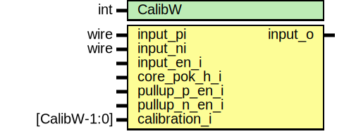

# Entity: prim_generic_usb_diff_rx

- **File**: prim_generic_usb_diff_rx.sv
## Diagram

## Description

 Copyright lowRISC contributors.
 Licensed under the Apache License, Version 2.0, see LICENSE for details.
 SPDX-License-Identifier: Apache-2.0

 Generic differential receiver for USB. Note that this is meant for emulation purposes only, and
 the pull-up, calibration and pok signals are not connected in this module.

## Generics

| Generic name | Type | Value | Description |
| ------------ | ---- | ----- | ----------- |
| CalibW       | int  | 32    |             |
## Ports

| Port name     | Direction | Type         | Description                         |
| ------------- | --------- | ------------ | ----------------------------------- |
| input_pi      | input     | wire         | differential input                  |
| input_ni      | input     | wire         | differential input                  |
| input_en_i    | input     |              | input buffer enable                 |
| core_pok_h_i  | input     |              | core power indication at VCC level  |
| pullup_p_en_i | input     |              | pullup enable for P                 |
| pullup_n_en_i | input     |              | pullup enable for N                 |
| calibration_i | input     | [CalibW-1:0] | calibration input                   |
| input_o       | output    |              | output of differential input buffer |
## Signals

| Name               | Type               | Description |
| ------------------ | ------------------ | ----------- |
| unused_pullup_p_en | logic              |             |
| unused_pullup_n_en | logic              |             |
| unused_calibration | logic [CalibW-1:0] |             |
| unused_core_pok    | logic              |             |
