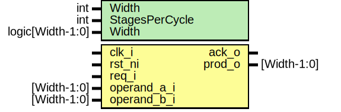

# Entity: prim_gf_mult

- **File**: prim_gf_mult.sv
## Diagram

## Description

 Copyright lowRISC contributors.
 Licensed under the Apache License, Version 2.0, see LICENSE for details.
 SPDX-License-Identifier: Apache-2.0

 This module performs a the multiplication of two operands in Galois field GF(2^Width) modulo the
 provided irreducible polynomial using a parallel Mastrovito multipler [3]. To cut long paths
 potentially occurring for large data widths, the implementation provides a parameter
 StagesPerCycle to decompose the multiplication into Width/StagesPerCycle iterative steps
 (Digit-Serial/Parallel Multiplier [4]).

 Note that this module is not pipelined and produces an output sample every Width/StagesPerCycle
 cycles.

 References:

 [1] Patel, "Parallel Multiplier Designs for the Galois/Counter Mode of Operation",
 https://pdfs.semanticscholar.org/1246/a9ad98dc0421ccfc945e6529c886f23e848d.pdf
 [2] Wagner, "The Laws of Cryptography: The Finite Field GF(2^8)",
 http://www.cs.utsa.edu/~wagner/laws/FFM.html

 [3]: Mastrovito, "VLSI Designs for Multiplication over Finite Fields GF(2^m)",
 https://link.springer.com/chapter/10.1007/3-540-51083-4_67
 [4]: Song et al., "Efficient Finite Field Serial/Parallel Multiplication",
 https://ieeexplore.ieee.org/document/542803

## Generics

| Generic name   | Type             | Value     | Description                                                                                                                                                                                                                                                            |
| -------------- | ---------------- | --------- | ---------------------------------------------------------------------------------------------------------------------------------------------------------------------------------------------------------------------------------------------------------------------- |
| Width          | int              | 32        |                                                                                                                                                                                                                                                                        |
| StagesPerCycle | int              | Width     |                                                                                                                                                                                                                                                                        |
| Width          | logic[Width-1:0] | 1'b1 << 1 |  The field-generating, irreducible polynomial of degree Width.  Can for example be a Conway polynomial, see  http://www.math.rwth-aachen.de/~Frank.Luebeck/data/ConwayPol/CP2.html  For Width = 33, the Conway polynomial hast bits 32, 15, 9, 7, 4, 3, 0 set to one.  |
## Ports

| Port name   | Direction | Type        | Description |
| ----------- | --------- | ----------- | ----------- |
| clk_i       | input     |             |             |
| rst_ni      | input     |             |             |
| req_i       | input     |             |             |
| operand_a_i | input     | [Width-1:0] |             |
| operand_b_i | input     | [Width-1:0] |             |
| ack_o       | output    |             |             |
| prod_o      | output    | [Width-1:0] |             |
## Signals

| Name          | Type                                  | Description                                                                                   |
| ------------- | ------------------------------------- | --------------------------------------------------------------------------------------------- |
| reformat_data | logic [Loops-1:0][StagesPerCycle-1:0] |  reformat operand_b_i                                                                         |
| op_i_slice    | logic [StagesPerCycle-1:0]            |  this slice of operand bits used during each loop                                             |
| matrix        | logic [StagesPerCycle-1:0][Width-1:0] |  the matrix is made up of a series of GF(2^Width) * x                                         |
| vector        | logic [Width-1:0]                     |  since the matrix generation is not done in one go, we must remember  where it last left off  |
| cnt           | logic [CntWidth-1:0]                  |  this variable tracks which loop we are currently operating                                   |
| first         | logic                                 |  this variable tracks the first loop through the multiply                                     |
| prod_q        | logic [Width-1:0]                     |  intermediate prod held between loops                                                         |
| prod_d        | logic [Width-1:0]                     |  intermediate prod held between loops                                                         |
## Constants

| Name     | Type | Value                  | Description |
| -------- | ---- | ---------------------- | ----------- |
| Loops    | int  | Width / StagesPerCycle |             |
| CntWidth | int  | $clog2(Loops)          |             |
## Functions
- gf_mult2 (logic [Width-1:0] operand) return (logic [Width-1:0])
**Description**
 GF(2^Width) * x

- gen_matrix (logic) return (logic [StagesPerCycle-1:0][Width-1:0])
**Description**
 Matrix generate step

- gf_mult (logic [StagesPerCycle-1:0][Width-1) return (logic [Width-1:0])
**Description**
 Galois multiply step

