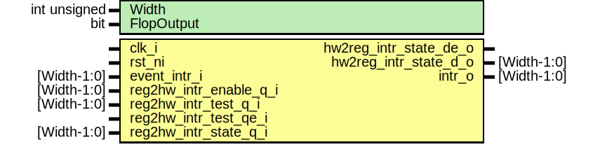

# Entity: prim_intr_hw

## Diagram

## Description

Copyright lowRISC contributors.
 Licensed under the Apache License, Version 2.0, see LICENSE for details.
 SPDX-License-Identifier: Apache-2.0
 Primitive interrupt handler. This assumes the existence of three
 controller registers: INTR_ENABLE, INTR_STATE, INTR_TEST.
 This module can be instantiated once per interrupt field, or
 "bussified" with all fields of the interrupt vector.
 
## Generics

| Generic name | Type         | Value | Description |
| ------------ | ------------ | ----- | ----------- |
| Width        | int unsigned | 1     |             |
| FlopOutput   | bit          | 1     |             |
## Ports

| Port name              | Direction | Type        | Description        |
| ---------------------- | --------- | ----------- | ------------------ |
| clk_i                  | input     |             | event              |
| rst_ni                 | input     |             |                    |
| event_intr_i           | input     | [Width-1:0] |                    |
| reg2hw_intr_enable_q_i | input     | [Width-1:0] | register interface |
| reg2hw_intr_test_q_i   | input     | [Width-1:0] |                    |
| reg2hw_intr_test_qe_i  | input     |             |                    |
| reg2hw_intr_state_q_i  | input     | [Width-1:0] |                    |
| hw2reg_intr_state_de_o | output    |             |                    |
| hw2reg_intr_state_d_o  | output    | [Width-1:0] |                    |
| intr_o                 | output    | [Width-1:0] | outgoing interrupt |
## Signals

| Name      | Type               | Description |
| --------- | ------------------ | ----------- |
| new_event | logic  [Width-1:0] |             |
