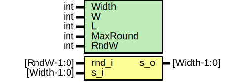

# Entity: prim_keccak
## Diagram

## Description
Copyright lowRISC contributors.
 Licensed under the Apache License, Version 2.0, see LICENSE for details.
 SPDX-License-Identifier: Apache-2.0
 prim_keccak is single round permutation module
 
## Generics
| Generic name | Type | Value              | Description                           |
| ------------ | ---- | ------------------ | ------------------------------------- |
| Width        | int  | 1600               | b= {25, 50, 100, 200, 400, 800, 1600} |
| W            | int  | Width/25           | Derived                               |
| L            | int  | $clog2(W)          |                                       |
| MaxRound     | int  | 12 + 2*L           | Keccak-f only                         |
| RndW         | int  | $clog2(MaxRound+1) | Representing up to MaxRound           |
## Ports
| Port name | Direction | Type        | Description   |
| --------- | --------- | ----------- | ------------- |
| rnd_i     | input     | [RndW-1:0]  | Current Round |
| s_i       | input     | [Width-1:0] |               |
| s_o       | output    | [Width-1:0] |               |
## Signals
| Name       | Type        | Description |
| ---------- | ----------- | ----------- |
| state_in   | box_t       |             |
| keccak_f   | box_t       |             |
| theta_data | box_t       |             |
| rho_data   | box_t       |             |
| pi_data    | box_t       |             |
| chi_data   | box_t       |             |
| iota_data  | box_t       |             |
| result     | box_t       |             |
| result     | return      |             |
| iota       | endfunction |             |
## Constants
| Name      | Type         | Value              | Description                                                                                                                                                                                                                                                                                                                                                                                                                                               |
| --------- | ------------ | ------------------ | --------------------------------------------------------------------------------------------------------------------------------------------------------------------------------------------------------------------------------------------------------------------------------------------------------------------------------------------------------------------------------------------------------------------------------------------------------- |
| W         | int          | Width/25           | Derived                                                                                                                                                                                                                                                                                                                                                                                                                                                   |
| L         | int          | $clog2(W)          |                                                                                                                                                                                                                                                                                                                                                                                                                                                           |
| MaxRound  | int          | 12 + 2*L           | Keccak-f only                                                                                                                                                                                                                                                                                                                                                                                                                                             |
| RndW      | int          | $clog2(MaxRound+1) | Representing up to MaxRound                                                                                                                                                                                                                                                                                                                                                                                                                               |
| RhoOffset | int          | undefined          | Rho ====================================================================== As RhoOffset[x][y] is considered as variable int in VCS, it is replaced with generate statement.                                                                                                                                                                                                                                                                               |
| PiRotate  | int          | undefined          | pi rearrange the position of lanes pi[x,y,z] = state[(x+3y),x,z]                                                                                                                                                                                                                                                                                                                                                                                          |
| RC        | logic [63:0] | undefined          | iota XOR (x,y) = (0,0) with round constant RC parameter: Precomputed by util/keccak_rc.py. Only up-to 0..L-1 is used RC = '0 RC[2**j-1] = rc(j+7*rnd) rc(t) = 1. t%255 == 0 -> 1 2. R[0:7] = 'b10000000 3. for i = [1..t%255] a. R = 0 || R b. R[0] = R[0] ^ R[8] c. R[4] = R[4] ^ R[8] d. R[5] = R[5] ^ R[8] e. R[6] = R[6] ^ R[8] f. R = R[0:7] 4. return R[0] RC has L = [0..6] for lower L case, only chopping lower part of 64bit RC is sufficient.  |
## Types
| Name    | Type                    | Description                |
| ------- | ----------------------- | -------------------------- |
| box_t   | logic [4:0][4:0][W-1:0] | (x,y,z) state              |
| lane_t  | logic           [W-1:0] | (z)                        |
| plane_t | logic [4:0]     [W-1:0] | (x,z)                      |
| slice_t | logic [4:0][4:0]        | (x,y)                      |
| sheet_t | logic      [4:0][W-1:0] | (y,z) identical to plane_t |
| row_t   | logic [4:0]             | (x)                        |
| col_t   | logic      [4:0]        | (y) identical to row_t     |
