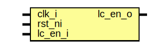

# Entity: prim_lc_sender
## Diagram

## Description
Copyright lowRISC contributors.
 Licensed under the Apache License, Version 2.0, see LICENSE for details.
 SPDX-License-Identifier: Apache-2.0
 Multibit life cycle signal sender module.
 This module is instantiates a hand-picked flop cell
 for each bit in the life cycle control signal such that tools do not
 optimize the multibit encoding.
 
## Ports
| Port name | Direction | Type | Description |
| --------- | --------- | ---- | ----------- |
| clk_i     | input     |      |             |
| rst_ni    | input     |      |             |
| lc_en_i   | input     |      |             |
| lc_en_o   | output    |      |             |
## Signals
| Name      | Type                             | Description |
| --------- | -------------------------------- | ----------- |
| lc_en     | logic [lc_ctrl_pkg::TxWidth-1:0] |             |
| lc_en_out | logic [lc_ctrl_pkg::TxWidth-1:0] |             |
## Instantiations
- u_prim_flop: prim_flop
