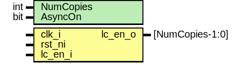

# Entity: prim_lc_sync

## Diagram

## Description

Copyright lowRISC contributors.
 Licensed under the Apache License, Version 2.0, see LICENSE for details.
 SPDX-License-Identifier: Apache-2.0
 Double-synchronizer flop for life cycle control signals with additional
 output buffers and life-cycle specific assertions.
 Should be used exactly as recommended in the life cycle controller spec:
 https://docs.opentitan.org/hw/ip/lc_ctrl/doc/index.html#control-signal-propagation
 
## Generics

| Generic name | Type | Value | Description                                                                                                                                                                                                |
| ------------ | ---- | ----- | ---------------------------------------------------------------------------------------------------------------------------------------------------------------------------------------------------------- |
| NumCopies    | int  | 1     | Number of separately buffered output signals. The buffer cells have a don't touch constraint on them such that synthesis tools won't collapse all copies into one signal.                                  |
| AsyncOn      | bit  | 1     | This instantiates the synchronizer flops if set to 1. In special cases where the receiver is in the same clock domain as the sender, this can be set to 0. However, it is recommended to leave this at 1.  |
## Ports

| Port name | Direction | Type            | Description |
| --------- | --------- | --------------- | ----------- |
| clk_i     | input     |                 |             |
| rst_ni    | input     |                 |             |
| lc_en_i   | input     |                 |             |
| lc_en_o   | output    | [NumCopies-1:0] |             |
## Signals

| Name  | Type                             | Description |
| ----- | -------------------------------- | ----------- |
| lc_en | logic [lc_ctrl_pkg::TxWidth-1:0] |             |
