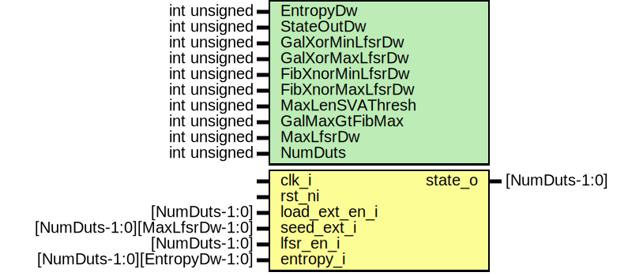

# Entity: prim_lfsr_fpv

- **File**: prim_lfsr_fpv.sv
## Diagram

## Description

Copyright lowRISC contributors.
 Licensed under the Apache License, Version 2.0, see LICENSE for details.
 SPDX-License-Identifier: Apache-2.0
 Testbench module for prim_lfsr. Intended to be used with a formal tool.
 
## Generics

| Generic name     | Type         | Value                                 | Description                                                                           |
| ---------------- | ------------ | ------------------------------------- | ------------------------------------------------------------------------------------- |
| EntropyDw        | int unsigned | 1                                     | LFSR entropy and output bitwidths (set to 1 here as they are unused)                  |
| StateOutDw       | int unsigned | 1                                     |                                                                                       |
| GalXorMinLfsrDw  | int unsigned | 4                                     | this specifies the range of differently parameterized LFSRs to instantiate and check  |
| GalXorMaxLfsrDw  | int unsigned | 64                                    |                                                                                       |
| FibXnorMinLfsrDw | int unsigned | 3                                     |                                                                                       |
| FibXnorMaxLfsrDw | int unsigned | 168                                   |                                                                                       |
| MaxLenSVAThresh  | int unsigned | 10                                    | LFSRs up to this bitwidth are checked for maximum length                              |
| GalMaxGtFibMax   | int unsigned | GalXorMaxLfsrDw > FibXnorMaxLfsrDw    | derived params                                                                        |
| MaxLfsrDw        | int unsigned | GalXorMaxLfsrDw * GalMaxGtFibMax +    |                                                                                       |
| NumDuts          | int unsigned | FibXnorMaxLfsrDw - FibXnorMinLfsrDw + |                                                                                       |
## Ports

| Port name     | Direction | Type                         | Description |
| ------------- | --------- | ---------------------------- | ----------- |
| clk_i         | input     |                              |             |
| rst_ni        | input     |                              |             |
| load_ext_en_i | input     | [NumDuts-1:0]                |             |
| seed_ext_i    | input     | [NumDuts-1:0][MaxLfsrDw-1:0] |             |
| lfsr_en_i     | input     | [NumDuts-1:0]                |             |
| entropy_i     | input     | [NumDuts-1:0][EntropyDw-1:0] |             |
| state_o       | output    | [NumDuts-1:0]                |             |
## Constants

| Name           | Type         | Value                                 | Description     |
| -------------- | ------------ | ------------------------------------- | --------------- |
| GalMaxGtFibMax | int unsigned | GalXorMaxLfsrDw > FibXnorMaxLfsrDw    | derived params  |
| MaxLfsrDw      | int unsigned | GalXorMaxLfsrDw * GalMaxGtFibMax +    |                 |
| NumDuts        | int unsigned | FibXnorMaxLfsrDw - FibXnorMinLfsrDw + |                 |
