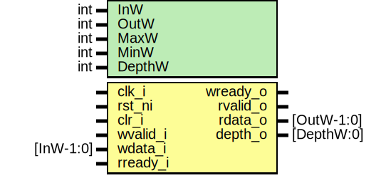

# Entity: prim_packer_fifo

- **File**: prim_packer_fifo.sv
## Diagram

## Description

 Copyright lowRISC contributors.
 Licensed under the Apache License, Version 2.0, see LICENSE for details.
 SPDX-License-Identifier: Apache-2.0

 Supports packed and unpacked modes
 Uses FIFO timing on the control signals
 No masking or flush functions supported
 Timings - case where InW < OutW
 clk_i      __|~~|__~~|__|~~|__~~|__|~~|__~~|__|~~|__~~|__|~~|__~~|__|~~|__
 wvalid_i   _____|~~~~|_____|~~~~|_____|~~~~|_____|~~~~|___________________
 wdata_i    Val N     |Val N+1   |Val N+2   |Val N+3   |-------------------
 wready_o   ~~~~~~~~~~~~~~~~~~~~~~~~~~~~~~~~~~~~~~~~~~~|__________|~~~~~~~~
 rvalid_o   ___________________________________________|~~~~~~~~~~|________
 rdata_o    -------------------------------------------|Val       |--------
 rready_i   _________________________________________________|~~~~|________
 depth_o    0000000000|1111111111|2222222222|3333333333|4444444444|00000000
 Timings - case where InW > OutW
 clk_i      __|~~|__~~|__|~~|__~~|__|~~|__~~|__|~~|__~~|__|~~|__~~|__|~~|__
 wvalid_i   _____|~~~~|____________________________________________________
 wdata_i    -----|Val |----------------------------------------------------
 wready_o   ~~~~~~~~~~|___________________________________________|~~~~~~~~
 rvalid_o   __________|~~~~~~~~~~~~~~~~~~~~~~~~~~~~~~~~~~~~~~~~~~~|________
 rdata_o    ----------|Val N     |Val N+1   |Val N+2   |Val N+3   |--------
 rready_i   ________________|~~~~|_____|~~~~|_____|~~~~|_____|~~~~|________
 depth_o    0000000000|4444444444|3333333333|2222222222|1111111111|00000000
 Timings - case where InW = OutW
 clk_i      __|~~|__~~|__|~~|__~~|__|~~|__~~|__|~~|__~~|__|~~|__~~|__|~~|__
 wvalid_i   _____|~~~~|____________________________________________________
 wdata_i    -----|Val |----------------------------------------------------
 wready_o   ~~~~~~~~~~|__________|~~~~~~~~~~~~~~~~~~~~~~~~~~~~~~~~~~~~~~~~~
 rvalid_o   __________|~~~~~~~~~~|_________________________________________
 rdata_o    ----------|Val       |-----------------------------------------
 rready_i   ________________|~~~~|_________________________________________
 depth_o    0000000000|1111111111|00000000000000000000000000000000000000000

## Generics

| Generic name | Type | Value             | Description          |
| ------------ | ---- | ----------------- | -------------------- |
| InW          | int  | 32                |                      |
| OutW         | int  | 8                 |                      |
| MaxW         | int  | InW               |  derived parameters  |
| MinW         | int  | InW               |                      |
| DepthW       | int  | $clog2(MaxW/MinW) |                      |
## Ports

| Port name | Direction | Type       | Description |
| --------- | --------- | ---------- | ----------- |
| clk_i     | input     |            |             |
| rst_ni    | input     |            |             |
| clr_i     | input     |            |             |
| wvalid_i  | input     |            |             |
| wdata_i   | input     | [InW-1:0]  |             |
| wready_o  | output    |            |             |
| rvalid_o  | output    |            |             |
| rdata_o   | output    | [OutW-1:0] |             |
| rready_i  | input     |            |             |
| depth_o   | output    | [DepthW:0] |             |
## Signals

| Name       | Type             | Description |
| ---------- | ---------------- | ----------- |
| load_data  | logic            |  signals    |
| clear_data | logic            |             |
| depth_q    | logic [DepthW:0] |  flops      |
| depth_d    | logic [DepthW:0] |  flops      |
| data_q     | logic [MaxW-1:0] |             |
| data_d     | logic [MaxW-1:0] |             |
| clr_q      | logic            |             |
| clr_d      | logic            |             |
## Constants

| Name       | Type           | Value                | Description          |
| ---------- | -------------- | -------------------- | -------------------- |
| MaxW       | int            | InW                  |  derived parameters  |
| MinW       | int            | InW                  |                      |
| DepthW     | int            | $clog2(MaxW/MinW)    |                      |
| WidthRatio | int unsigned   | MaxW / MinW          |                      |
| FullDepth  | bit [DepthW:0] | WidthRatio[DepthW:0] |                      |
## Processes
- unnamed: ( @(posedge clk_i or negedge rst_ni) )
  - **Type:** always_ff
