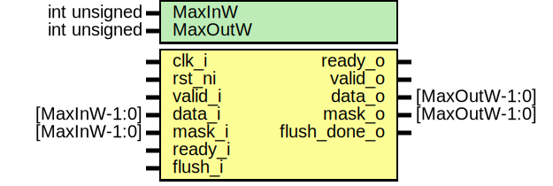

# Entity: prim_packer_fpv

- **File**: prim_packer_fpv.sv
## Diagram

## Description

Copyright lowRISC contributors.
 Licensed under the Apache License, Version 2.0, see LICENSE for details.
 SPDX-License-Identifier: Apache-2.0
 Testbench module for prim_packer. Intended to be used with a formal tool.
 To reduce the runtime for prim_packer, we limited the width parameter.
 
## Generics

| Generic name | Type         | Value | Description |
| ------------ | ------------ | ----- | ----------- |
| MaxInW       | int unsigned | 64    |             |
| MaxOutW      | int unsigned | 64    |             |
## Ports

| Port name    | Direction | Type          | Description |
| ------------ | --------- | ------------- | ----------- |
| clk_i        | input     |               |             |
| rst_ni       | input     |               |             |
| valid_i      | input     |               |             |
| data_i       | input     | [MaxInW-1:0]  |             |
| mask_i       | input     | [MaxInW-1:0]  |             |
| ready_o      | output    |               |             |
| valid_o      | output    |               |             |
| data_o       | output    | [MaxOutW-1:0] |             |
| mask_o       | output    | [MaxOutW-1:0] |             |
| ready_i      | input     |               |             |
| flush_i      | input     |               |             |
| flush_done_o | output    |               |             |
## Instantiations

- i_prim_packer_max: prim_packer
