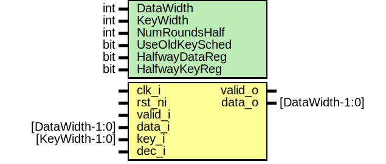

# Entity: prim_prince

- **File**: prim_prince.sv
## Diagram

## Description

 Copyright lowRISC contributors.
 Licensed under the Apache License, Version 2.0, see LICENSE for details.
 SPDX-License-Identifier: Apache-2.0

 This module is an implementation of the 64bit PRINCE block cipher. It is a fully unrolled
 combinational implementation with configurable number of rounds. Optionally, registers for the
 data and key states can be enabled, if this is required. Due to the reflective construction of
 this cipher, the same circuit can be used for encryption and decryption, as described below.
 Further, the primitive supports a 32bit block cipher flavor which is not specified in the
 original paper. It should be noted, however, that the 32bit version is **not** secure and must
 not be used in a setting where cryptographic cipher strength is required. The 32bit variant is
 only intended to be used as a lightweight data scrambling device.

 See also: prim_present, prim_cipher_pkg

 References: - https://en.wikipedia.org/wiki/PRESENT
             - https://en.wikipedia.org/wiki/Prince_(cipher)
             - http://www.lightweightcrypto.org/present/present_ches2007.pdf
             - https://csrc.nist.gov/csrc/media/events/lightweight-cryptography-workshop-2015/
               documents/papers/session7-maene-paper.pdf
             - https://eprint.iacr.org/2012/529.pdf
             - https://eprint.iacr.org/2015/372.pdf
             - https://eprint.iacr.org/2014/656.pdf

## Generics

| Generic name   | Type | Value | Description                                                                                                                                                       |
| -------------- | ---- | ----- | ----------------------------------------------------------------------------------------------------------------------------------------------------------------- |
| DataWidth      | int  | 64    |                                                                                                                                                                   |
| KeyWidth       | int  | 128   |                                                                                                                                                                   |
| NumRoundsHalf  | int  | 5     |  The construction is reflective. Total number of rounds is 2*NumRoundsHalf + 2                                                                                    |
| UseOldKeySched | bit  | 1'b0  |  This primitive uses the new key schedule proposed in https://eprint.iacr.org/2014/656.pdf  Setting this parameter to 1 falls back to the original key schedule.  |
| HalfwayDataReg | bit  | 1'b0  |  This instantiates a data register halfway in the primitive.                                                                                                      |
| HalfwayKeyReg  | bit  | 1'b0  |  This instantiates a key register halfway in the primitive.                                                                                                       |
## Ports

| Port name | Direction | Type            | Description             |
| --------- | --------- | --------------- | ----------------------- |
| clk_i     | input     |                 |                         |
| rst_ni    | input     |                 |                         |
| valid_i   | input     |                 |                         |
| data_i    | input     | [DataWidth-1:0] |                         |
| key_i     | input     | [KeyWidth-1:0]  |                         |
| dec_i     | input     |                 | set to 1 for decryption |
| valid_o   | output    |                 |                         |
| data_o    | output    | [DataWidth-1:0] |                         |
## Signals

| Name                | Type                                       | Description                                            |
| ------------------- | ------------------------------------------ | ------------------------------------------------------ |
| k0                  | logic [DataWidth-1:0]                      | /////////////////  key expansion // /////////////////  |
| k0_prime_d          | logic [DataWidth-1:0]                      | /////////////////  key expansion // /////////////////  |
| k1_d                | logic [DataWidth-1:0]                      | /////////////////  key expansion // /////////////////  |
| k0_new_d            | logic [DataWidth-1:0]                      | /////////////////  key expansion // /////////////////  |
| k0_prime_q          | logic [DataWidth-1:0]                      | /////////////////  key expansion // /////////////////  |
| k1_q                | logic [DataWidth-1:0]                      | /////////////////  key expansion // /////////////////  |
| k0_new_q            | logic [DataWidth-1:0]                      | /////////////////  key expansion // /////////////////  |
| data_state          | logic [NumRoundsHalf*2+1:0][DataWidth-1:0] | verilator split_var */                                 |
| data_state_middle_d | logic [DataWidth-1:0]                      |  middle part                                           |
| data_state_middle_q | logic [DataWidth-1:0]                      |  middle part                                           |
| data_state_middle   | logic [DataWidth-1:0]                      |  middle part                                           |
| gen_bkwd_key_even   | else                                       |                                                        |
| assign              | end                                        |                                                        |
| data_state_bwd      | logic [DataWidth-1:0]                      |                                                        |
| data_o              | end                                        |                                                        |
| k0_prime_q          | data_o                                     |                                                        |
## Processes
- p_key_expansion: (  )
  - **Type:** always_comb
- p_pre_round_xor: (  )
  - **Type:** always_comb
 **Description**
 pre-round XOR 
