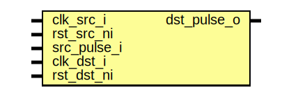

# Entity: prim_pulse_sync

## Diagram

## Description

Copyright lowRISC contributors.
 Licensed under the Apache License, Version 2.0, see LICENSE for details.
 SPDX-License-Identifier: Apache-2.0
 Pulse synchronizer: synchronizes a pulse from source clock domain (clk_src)
 to destination clock domain (clk_dst). Each pulse has the length of one clock
 cycle of its respective clock domain. Consecutive pulses need to be spaced
 appropriately apart from each other depending on the clock frequency ratio
 of the two clock domains.
 
## Ports

| Port name   | Direction | Type | Description              |
| ----------- | --------- | ---- | ------------------------ |
| clk_src_i   | input     |      | source clock domain      |
| rst_src_ni  | input     |      |                          |
| src_pulse_i | input     |      |                          |
| clk_dst_i   | input     |      | destination clock domain |
| rst_dst_ni  | input     |      |                          |
| dst_pulse_o | output    |      |                          |
## Signals

| Name        | Type  | Description |
| ----------- | ----- | ----------- |
| src_level   | logic |             |
| dst_level   | logic |             |
| dst_level_q | logic |             |
## Processes
- unnamed: ( @(posedge clk_src_i or negedge rst_src_ni) )
- unnamed: ( @(posedge clk_dst_i or negedge rst_dst_ni) )
**Description**
delay dst_level by 1 cycle

## Instantiations

- prim_flop_2sync: prim_flop_2sync
