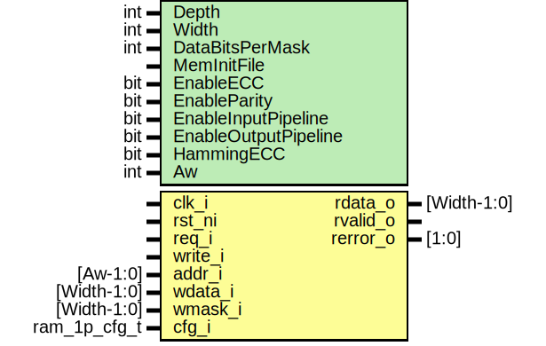

# Entity: prim_ram_1p_adv

- **File**: prim_ram_1p_adv.sv
## Diagram

## Description

Copyright lowRISC contributors.
 Licensed under the Apache License, Version 2.0, see LICENSE for details.
 SPDX-License-Identifier: Apache-2.0
 Single-Port SRAM Wrapper
 Supported configurations:
 - ECC for 32b and 64b wide memories with no write mask
   (Width == 32 or Width == 64, DataBitsPerMask is ignored).
 - Byte parity if Width is a multiple of 8 bit and write masks have Byte
   granularity (DataBitsPerMask == 8).
 Note that the write mask needs to be per Byte if parity is enabled. If ECC is enabled, the write
 mask cannot be used and has to be tied to {Width{1'b1}}.
 
## Generics

| Generic name         | Type | Value                       | Description                                                                                                                                                                                                               |
| -------------------- | ---- | --------------------------- | ------------------------------------------------------------------------------------------------------------------------------------------------------------------------------------------------------------------------- |
| Depth                | int  | 512                         |                                                                                                                                                                                                                           |
| Width                | int  | 32                          |                                                                                                                                                                                                                           |
| DataBitsPerMask      | int  | 1                           | Number of data bits per bit of write mask                                                                                                                                                                                 |
| MemInitFile          |      | ""                          | VMEM file to initialize the memory with                                                                                                                                                                                   |
| EnableECC            | bit  | 0                           | Enables per-word ECC                                                                                                                                                                                                      |
| EnableParity         | bit  | 0                           | Enables per-Byte Parity                                                                                                                                                                                                   |
| EnableInputPipeline  | bit  | 0                           | Adds an input register (read latency +1)                                                                                                                                                                                  |
| EnableOutputPipeline | bit  | 0                           | Adds an output register (read latency +1)                                                                                                                                                                                 |
| HammingECC           | bit  | 0                           | This switch allows to switch to standard Hamming ECC instead of the HSIAO ECC. It is recommended to leave this parameter at its default setting (HSIAO), since this results in a more compact and faster implementation.  |
| Aw                   | int  | prim_util_pkg::vbits(Depth) |                                                                                                                                                                                                                           |
## Ports

| Port name | Direction | Type         | Description                            |
| --------- | --------- | ------------ | -------------------------------------- |
| clk_i     | input     |              |                                        |
| rst_ni    | input     |              |                                        |
| req_i     | input     |              |                                        |
| write_i   | input     |              |                                        |
| addr_i    | input     | [Aw-1:0]     |                                        |
| wdata_i   | input     | [Width-1:0]  |                                        |
| wmask_i   | input     | [Width-1:0]  |                                        |
| rdata_o   | output    | [Width-1:0]  |                                        |
| rvalid_o  | output    |              | read response (rdata_o) is valid       |
| rerror_o  | output    | [1:0]        | Bit1: Uncorrectable, Bit0: Correctable |
| cfg_i     | input     | ram_1p_cfg_t | config                                 |
## Signals

| Name          | Type                   | Description |
| ------------- | ---------------------- | ----------- |
| req_q         | logic                  |             |
| req_d         | logic                  |             |
| write_q       | logic                  |             |
| write_d       | logic                  |             |
| addr_q        | logic [Aw-1:0]         |             |
| addr_d        | logic [Aw-1:0]         |             |
| wdata_q       | logic [TotalWidth-1:0] |             |
| wdata_d       | logic [TotalWidth-1:0] |             |
| wmask_q       | logic [TotalWidth-1:0] |             |
| wmask_d       | logic [TotalWidth-1:0] |             |
| rvalid_q      | logic                  |             |
| rvalid_d      | logic                  |             |
| rvalid_sram_q | logic                  |             |
| rdata_q       | logic [Width-1:0]      |             |
| rdata_d       | logic [Width-1:0]      |             |
| rdata_sram    | logic [TotalWidth-1:0] |             |
| rerror_q      | logic [1:0]            |             |
| rerror_d      | logic [1:0]            |             |
## Constants

| Name                 | Type | Value                       | Description                                                                                                                                                                                         |
| -------------------- | ---- | --------------------------- | --------------------------------------------------------------------------------------------------------------------------------------------------------------------------------------------------- |
| Aw                   | int  | prim_util_pkg::vbits(Depth) |                                                                                                                                                                                                     |
| ParWidth             | int  | Width                       | Calculate ECC width                                                                                                                                                                                 |
| TotalWidth           | int  | Width + ParWidth            |                                                                                                                                                                                                     |
| LocalDataBitsPerMask | int  | 9          :                | If byte parity is enabled, the write enable bits are used to write memory colums with 8 + 1 = 9 bit width (data plus corresponding parity bit). If ECC is enabled, the DataBitsPerMask is ignored.  |
## Processes
- unnamed: ( @(posedge clk_i or negedge rst_ni) )
## Instantiations

- u_mem: prim_ram_1p
