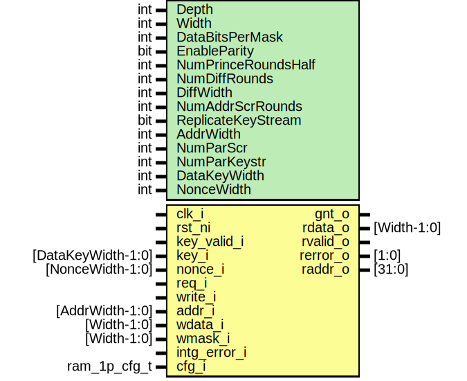

# Entity: prim_ram_1p_scr

- **File**: prim_ram_1p_scr.sv
## Diagram

## Description

 Copyright lowRISC contributors.
 Licensed under the Apache License, Version 2.0, see LICENSE for details.
 SPDX-License-Identifier: Apache-2.0

 This is a draft implementation of a low-latency memory scrambling mechanism.

 The module is implemented as a primitive, in the same spirit as similar prim_ram_1p_adv wrappers.
 Hence, it can be conveniently instantiated by comportable IPs (such as OTBN) or in top_earlgrey
 for the main system memory.

 The currently implemented architecture uses a reduced-round PRINCE cipher primitive in CTR mode
 in order to (weakly) scramble the data written to the memory macro. Plain CTR mode does not
 diffuse the data since the keystream is just XOR'ed onto it, hence we also we perform byte-wise
 diffusion using a (shallow) substitution/permutation network layers in order to provide a limited
 avalanche effect within a byte.

 In order to break the linear addressing space, the address is passed through a bijective
 scrambling function constructed using a (shallow) substitution/permutation and a nonce. Due to
 that nonce, the address mapping is not fully baked into RTL and can be changed at runtime as
 well.

 See also: prim_cipher_pkg, prim_prince

## Generics

| Generic name        | Type | Value                       | Description                                                                                                                                                                                                                                                                                                                             |
| ------------------- | ---- | --------------------------- | --------------------------------------------------------------------------------------------------------------------------------------------------------------------------------------------------------------------------------------------------------------------------------------------------------------------------------------- |
| Depth               | int  | 16*1024                     |  Needs to be a power of 2 if NumAddrScrRounds > 0.                                                                                                                                                                                                                                                                                      |
| Width               | int  | 32                          |  Needs to be byte aligned if byte parity is enabled.                                                                                                                                                                                                                                                                                    |
| DataBitsPerMask     | int  | 8                           |  Needs to be set to 8 in case of byte parity.                                                                                                                                                                                                                                                                                           |
| EnableParity        | bit  | 1                           |  Enable byte parity.                                                                                                                                                                                                                                                                                                                    |
| NumPrinceRoundsHalf | int  | 2                           |  Scrambling parameters. Note that this needs to be low-latency, hence we have to keep the  amount of cipher rounds low. PRINCE has 5 half rounds in its original form, which corresponds  to 2*5 + 1 effective rounds. Setting this to 2 halves this to approximately 5 effective rounds.  Number of PRINCE half rounds, can be [1..5]  |
| NumDiffRounds       | int  | 2                           |  Number of extra diffusion rounds. Setting this to 0 to disable diffusion.                                                                                                                                                                                                                                                              |
| DiffWidth           | int  | DataBitsPerMask             |  This parameter governs the block-width of additional diffusion layers.  For intra-byte diffusion, set this parameter to 8.                                                                                                                                                                                                             |
| NumAddrScrRounds    | int  | 2                           |  Number of address scrambling rounds. Setting this to 0 disables address scrambling.                                                                                                                                                                                                                                                    |
| ReplicateKeyStream  | bit  | 1'b0                        |  If set to 1, the same 64bit key stream is replicated if the data port is wider than 64bit.  If set to 0, the cipher primitive is replicated, and together with a wider nonce input,  a unique keystream is generated for the full data width.                                                                                          |
| AddrWidth           | int  | prim_util_pkg::vbits(Depth) |  Derived parameters                                                                                                                                                                                                                                                                                                                     |
| NumParScr           | int  | 64                          |  Depending on the data width, we need to instantiate multiple parallel cipher primitives to  create a keystream that is wide enough (PRINCE has a block size of 64bit)                                                                                                                                                                  |
| NumParKeystr        | int  | 64                          |                                                                                                                                                                                                                                                                                                                                         |
| DataKeyWidth        | int  | 128                         |  This is given by the PRINCE cipher primitive. All parallel cipher modules  use the same key, but they use a different IV                                                                                                                                                                                                               |
| NonceWidth          | int  | 64 * NumParScr              |  Each 64 bit scrambling primitive requires a 64bit IV                                                                                                                                                                                                                                                                                   |
## Ports

| Port name    | Direction | Type               | Description                                                                                                                                                                                                                                |
| ------------ | --------- | ------------------ | ------------------------------------------------------------------------------------------------------------------------------------------------------------------------------------------------------------------------------------------ |
| clk_i        | input     |                    |                                                                                                                                                                                                                                            |
| rst_ni       | input     |                    |                                                                                                                                                                                                                                            |
| key_valid_i  | input     |                    |  Key interface. Memory requests will not be granted if key_valid is set to 0.                                                                                                                                                              |
| key_i        | input     | [DataKeyWidth-1:0] |                                                                                                                                                                                                                                            |
| nonce_i      | input     | [NonceWidth-1:0]   |                                                                                                                                                                                                                                            |
| req_i        | input     |                    |  Interface to TL-UL SRAM adapter                                                                                                                                                                                                           |
| gnt_o        | output    |                    |                                                                                                                                                                                                                                            |
| write_i      | input     |                    |                                                                                                                                                                                                                                            |
| addr_i       | input     | [AddrWidth-1:0]    |                                                                                                                                                                                                                                            |
| wdata_i      | input     | [Width-1:0]        |                                                                                                                                                                                                                                            |
| wmask_i      | input     | [Width-1:0]        | Needs to be byte-aligned for parity                                                                                                                                                                                                        |
| intg_error_i | input     |                    |  The incoming transaction contains an integrity error and the module should alter its behavior appropriately.  On integrity errors, the primitive reverses the bit-order of the nonce and surpresses  any real transaction to the memory.  |
| rdata_o      | output    | [Width-1:0]        |                                                                                                                                                                                                                                            |
| rvalid_o     | output    |                    | Read response (rdata_o) is valid                                                                                                                                                                                                           |
| rerror_o     | output    | [1:0]              | Bit1: Uncorrectable, Bit0: Correctable                                                                                                                                                                                                     |
| raddr_o      | output    | [31:0]             | Read address for error reporting.                                                                                                                                                                                                          |
| cfg_i        | input     | ram_1p_cfg_t       |  config                                                                                                                                                                                                                                    |
## Signals

| Name                | Type                                      | Description                                                                                                                                                                                                                                                                                                                                                                                                                                                                                                                                                                                                                                                                                                                                                                                                                                                                                                                                                                                                                        |
| ------------------- | ----------------------------------------- | ---------------------------------------------------------------------------------------------------------------------------------------------------------------------------------------------------------------------------------------------------------------------------------------------------------------------------------------------------------------------------------------------------------------------------------------------------------------------------------------------------------------------------------------------------------------------------------------------------------------------------------------------------------------------------------------------------------------------------------------------------------------------------------------------------------------------------------------------------------------------------------------------------------------------------------------------------------------------------------------------------------------------------------- |
| read_en             | logic                                     | ///////////////////////////////////////  Pending Write and Address Registers // ///////////////////////////////////////  Writes are delayed by one cycle, such the same keystream generation primitive (prim_prince) can  be reused among reads and writes. Note however that with this arrangement, we have to introduce  a mechanism to hold a pending write transaction in cases where that transaction is immediately  followed by a read. The pending write transaction is written to memory as soon as there is no  new read transaction incoming. The latter can be a special case if the incoming read goes to  the same address as the pending write. To that end, we detect the address collision and return  the data from the write holding register.  Read / write strobes                                                                                                                                                                                                                                            |
| write_en_d          | logic                                     | ///////////////////////////////////////  Pending Write and Address Registers // ///////////////////////////////////////  Writes are delayed by one cycle, such the same keystream generation primitive (prim_prince) can  be reused among reads and writes. Note however that with this arrangement, we have to introduce  a mechanism to hold a pending write transaction in cases where that transaction is immediately  followed by a read. The pending write transaction is written to memory as soon as there is no  new read transaction incoming. The latter can be a special case if the incoming read goes to  the same address as the pending write. To that end, we detect the address collision and return  the data from the write holding register.  Read / write strobes                                                                                                                                                                                                                                            |
| write_en_q          | logic                                     | ///////////////////////////////////////  Pending Write and Address Registers // ///////////////////////////////////////  Writes are delayed by one cycle, such the same keystream generation primitive (prim_prince) can  be reused among reads and writes. Note however that with this arrangement, we have to introduce  a mechanism to hold a pending write transaction in cases where that transaction is immediately  followed by a read. The pending write transaction is written to memory as soon as there is no  new read transaction incoming. The latter can be a special case if the incoming read goes to  the same address as the pending write. To that end, we detect the address collision and return  the data from the write holding register.  Read / write strobes                                                                                                                                                                                                                                            |
| write_pending_q     | logic                                     |                                                                                                                                                                                                                                                                                                                                                                                                                                                                                                                                                                                                                                                                                                                                                                                                                                                                                                                                                                                                                                    |
| addr_collision_d    | logic                                     |                                                                                                                                                                                                                                                                                                                                                                                                                                                                                                                                                                                                                                                                                                                                                                                                                                                                                                                                                                                                                                    |
| addr_collision_q    | logic                                     |                                                                                                                                                                                                                                                                                                                                                                                                                                                                                                                                                                                                                                                                                                                                                                                                                                                                                                                                                                                                                                    |
| waddr_q             | logic [AddrWidth-1:0]                     |                                                                                                                                                                                                                                                                                                                                                                                                                                                                                                                                                                                                                                                                                                                                                                                                                                                                                                                                                                                                                                    |
| macro_req           | logic                                     |  Macro requests and write strobe  The macro operation is silenced if an integrity error is seen                                                                                                                                                                                                                                                                                                                                                                                                                                                                                                                                                                                                                                                                                                                                                                                                                                                                                                                                    |
| intg_err_macro_req  | logic                                     |                                                                                                                                                                                                                                                                                                                                                                                                                                                                                                                                                                                                                                                                                                                                                                                                                                                                                                                                                                                                                                    |
| macro_write         | logic                                     |  We are allowed to write a pending write transaction to the memory if there is no incoming read                                                                                                                                                                                                                                                                                                                                                                                                                                                                                                                                                                                                                                                                                                                                                                                                                                                                                                                                    |
| rw_collision        | logic                                     |  New read write collision                                                                                                                                                                                                                                                                                                                                                                                                                                                                                                                                                                                                                                                                                                                                                                                                                                                                                                                                                                                                          |
| addr_mux            | logic [AddrWidth-1:0]                     | //////////////////////  Address Scrambling // //////////////////////  We only select the pending write address in case there is no incoming read transaction.                                                                                                                                                                                                                                                                                                                                                                                                                                                                                                                                                                                                                                                                                                                                                                                                                                                                      |
| addr_scr            | logic [AddrWidth-1:0]                     |  This creates a bijective address mapping using a substitution / permutation network.                                                                                                                                                                                                                                                                                                                                                                                                                                                                                                                                                                                                                                                                                                                                                                                                                                                                                                                                              |
| raddr_q             | logic [AddrWidth-1:0]                     |  We latch the non-scrambled address for error reporting.                                                                                                                                                                                                                                                                                                                                                                                                                                                                                                                                                                                                                                                                                                                                                                                                                                                                                                                                                                           |
| keystream           | logic [NumParScr*64-1:0]                  |                                                                                                                                                                                                                                                                                                                                                                                                                                                                                                                                                                                                                                                                                                                                                                                                                                                                                                                                                                                                                                    |
| data_scr_nonce      | logic [NumParScr-1:0][DataNonceWidth-1:0] |                                                                                                                                                                                                                                                                                                                                                                                                                                                                                                                                                                                                                                                                                                                                                                                                                                                                                                                                                                                                                                    |
| intg_err_data_scr   | logic                                     |                                                                                                                                                                                                                                                                                                                                                                                                                                                                                                                                                                                                                                                                                                                                                                                                                                                                                                                                                                                                                                    |
| keystream_repl      | logic [Width-1:0]                         |  Replicate keystream if needed                                                                                                                                                                                                                                                                                                                                                                                                                                                                                                                                                                                                                                                                                                                                                                                                                                                                                                                                                                                                     |
| rdata_scr           | logic [Width-1:0]                         | ///////////////////  Data Scrambling // ///////////////////  Data scrambling is a two step process. First, we XOR the write data with the keystream obtained  by operating a reduced-round PRINCE cipher in CTR-mode. Then, we diffuse data within each byte  in order to get a limited "avalanche" behavior in case parts of the bytes are flipped as a  result of a malicious attempt to tamper with the data in memory. We perform the diffusion only  within bytes in order to maintain the ability to write individual bytes. Note that the  keystream XOR is performed first for the write path such that it can be performed last for the  read path. This allows us to hide a part of the combinational delay of the PRINCE primitive  behind the propagation delay of the SRAM macro and the per-byte diffusion step.                                                                                                                                                                                                     |
| rdata               | logic [Width-1:0]                         | ///////////////////  Data Scrambling // ///////////////////  Data scrambling is a two step process. First, we XOR the write data with the keystream obtained  by operating a reduced-round PRINCE cipher in CTR-mode. Then, we diffuse data within each byte  in order to get a limited "avalanche" behavior in case parts of the bytes are flipped as a  result of a malicious attempt to tamper with the data in memory. We perform the diffusion only  within bytes in order to maintain the ability to write individual bytes. Note that the  keystream XOR is performed first for the write path such that it can be performed last for the  read path. This allows us to hide a part of the combinational delay of the PRINCE primitive  behind the propagation delay of the SRAM macro and the per-byte diffusion step.                                                                                                                                                                                                     |
| wdata_scr_d         | logic [Width-1:0]                         |                                                                                                                                                                                                                                                                                                                                                                                                                                                                                                                                                                                                                                                                                                                                                                                                                                                                                                                                                                                                                                    |
| wdata_scr_q         | logic [Width-1:0]                         |                                                                                                                                                                                                                                                                                                                                                                                                                                                                                                                                                                                                                                                                                                                                                                                                                                                                                                                                                                                                                                    |
| wdata_q             | logic [Width-1:0]                         |                                                                                                                                                                                                                                                                                                                                                                                                                                                                                                                                                                                                                                                                                                                                                                                                                                                                                                                                                                                                                                    |
| write_scr_pending_d | logic                                     | //////////////////////////////////////////////  Scrambled data register and forwarding mux // //////////////////////////////////////////////  This is the scrambled data holding register for pending writes. This is needed in order to make  back to back patterns of the form WR -> RD -> WR work:   cycle:          0   |  1   | 2   | 3   |  incoming op:    WR0 |  RD  | WR1 | -   |  prince:         -   |  WR0 | RD  | WR1 |  memory op:      -   |  RD  | WR0 | WR1 |   The read transaction in cycle 1 interrupts the first write transaction which has already used  the PRINCE primitive for scrambling. If this sequence is followed by another write back-to-back  in cycle 2, we cannot use the PRINCE primitive a second time for the first write, and hence  need an additional holding register that can buffer the scrambled data of the first write in  cycle 1.  Clear this if we can write the memory in this cycle. Set only if the current write cannot  proceed due to an incoming read operation.  |
| wdata_scr           | logic [Width-1:0]                         |  Select the correct scrambled word to be written, based on whether the word in the scrambled  data holding register is valid or not. Note that the write_scr_q register could in theory be  combined with the wdata_q register. We don't do that here for timing reasons, since that would  require another read data mux to inject the scrambled data into the read descrambling path.                                                                                                                                                                                                                                                                                                                                                                                                                                                                                                                                                                                                                                            |
| rvalid_q            | logic                                     |  Output read valid strobe                                                                                                                                                                                                                                                                                                                                                                                                                                                                                                                                                                                                                                                                                                                                                                                                                                                                                                                                                                                                          |
| intg_error_q        | logic                                     |                                                                                                                                                                                                                                                                                                                                                                                                                                                                                                                                                                                                                                                                                                                                                                                                                                                                                                                                                                                                                                    |
| wmask_q             | logic [Width-1:0]                         |                                                                                                                                                                                                                                                                                                                                                                                                                                                                                                                                                                                                                                                                                                                                                                                                                                                                                                                                                                                                                                    |
## Constants

| Name           | Type | Value                       | Description                                                                                                                                                                                                                                                                                                                                                                                           |
| -------------- | ---- | --------------------------- | ----------------------------------------------------------------------------------------------------------------------------------------------------------------------------------------------------------------------------------------------------------------------------------------------------------------------------------------------------------------------------------------------------- |
| AddrWidth      | int  | prim_util_pkg::vbits(Depth) |  Derived parameters                                                                                                                                                                                                                                                                                                                                                                                   |
| NumParScr      | int  | 64                          |  Depending on the data width, we need to instantiate multiple parallel cipher primitives to  create a keystream that is wide enough (PRINCE has a block size of 64bit)                                                                                                                                                                                                                                |
| NumParKeystr   | int  | 64                          |                                                                                                                                                                                                                                                                                                                                                                                                       |
| DataKeyWidth   | int  | 128                         |  This is given by the PRINCE cipher primitive. All parallel cipher modules  use the same key, but they use a different IV                                                                                                                                                                                                                                                                             |
| NonceWidth     | int  | 64 * NumParScr              |  Each 64 bit scrambling primitive requires a 64bit IV                                                                                                                                                                                                                                                                                                                                                 |
| DataNonceWidth | int  | 64 - AddrWidth              | ////////////////////////////////////////////  Keystream Generation for Data Scrambling // ////////////////////////////////////////////  This encrypts the IV consisting of the nonce and address using the key provided in order to  generate the keystream for the data. Note that we instantiate a register halfway within this  primitive to balance the delay between request and response side.  |
## Processes
- p_forward_mux: (  )
  - **Type:** always_comb
- p_wdata_buf: ( @(posedge clk_i or negedge rst_ni) )
  - **Type:** always_ff
 **Description**
/////////////  Registers // ///////////// 
## Instantiations

- u_intg_err_macro_req: prim_buf
- u_intg_err_data_scr: prim_buf
- u_prim_ram_1p_adv: prim_ram_1p_adv
 **Description**
////////////////
 Memory Macro //
////////////////

