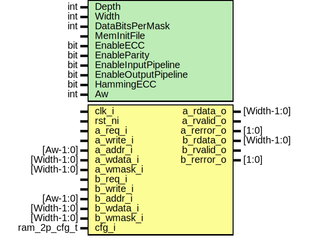

# Entity: prim_ram_2p_adv
## Diagram

## Description
Copyright lowRISC contributors.
 Licensed under the Apache License, Version 2.0, see LICENSE for details.
 SPDX-License-Identifier: Apache-2.0
 Dual-Port SRAM Wrapper
 Supported configurations:
 - ECC for 32b and 64b wide memories with no write mask
   (Width == 32 or Width == 64, DataBitsPerMask is ignored).
 - Byte parity if Width is a multiple of 8 bit and write masks have Byte
   granularity (DataBitsPerMask == 8).
 Note that the write mask needs to be per Byte if parity is enabled. If ECC is enabled, the write
 mask cannot be used and has to be tied to {Width{1'b1}}.
 
## Generics
| Generic name         | Type | Value                       | Description                                                                                                                                                                                                               |
| -------------------- | ---- | --------------------------- | ------------------------------------------------------------------------------------------------------------------------------------------------------------------------------------------------------------------------- |
| Depth                | int  | 512                         |                                                                                                                                                                                                                           |
| Width                | int  | 32                          |                                                                                                                                                                                                                           |
| DataBitsPerMask      | int  | 1                           | Number of data bits per bit of write mask                                                                                                                                                                                 |
| MemInitFile          |      | ""                          | VMEM file to initialize the memory with                                                                                                                                                                                   |
| EnableECC            | bit  | 0                           | Enables per-word ECC                                                                                                                                                                                                      |
| EnableParity         | bit  | 0                           | Enables per-Byte Parity                                                                                                                                                                                                   |
| EnableInputPipeline  | bit  | 0                           | Adds an input register (read latency +1)                                                                                                                                                                                  |
| EnableOutputPipeline | bit  | 0                           | Adds an output register (read latency +1)                                                                                                                                                                                 |
| HammingECC           | bit  | 0                           | This switch allows to switch to standard Hamming ECC instead of the HSIAO ECC. It is recommended to leave this parameter at its default setting (HSIAO), since this results in a more compact and faster implementation.  |
| Aw                   | int  | prim_util_pkg::vbits(Depth) |                                                                                                                                                                                                                           |
## Ports
| Port name  | Direction | Type         | Description                                    |
| ---------- | --------- | ------------ | ---------------------------------------------- |
| clk_i      | input     |              |                                                |
| rst_ni     | input     |              |                                                |
| a_req_i    | input     |              |                                                |
| a_write_i  | input     |              |                                                |
| a_addr_i   | input     | [Aw-1:0]     |                                                |
| a_wdata_i  | input     | [Width-1:0]  |                                                |
| a_wmask_i  | input     | [Width-1:0]  | cannot be used with ECC, tie to 1 in that case |
| a_rdata_o  | output    | [Width-1:0]  |                                                |
| a_rvalid_o | output    |              | read response (a_rdata_o) is valid             |
| a_rerror_o | output    | [1:0]        | Bit1: Uncorrectable, Bit0: Correctable         |
| b_req_i    | input     |              |                                                |
| b_write_i  | input     |              |                                                |
| b_addr_i   | input     | [Aw-1:0]     |                                                |
| b_wdata_i  | input     | [Width-1:0]  |                                                |
| b_wmask_i  | input     | [Width-1:0]  | cannot be used with ECC, tie to 1 in that case |
| b_rdata_o  | output    | [Width-1:0]  |                                                |
| b_rvalid_o | output    |              | read response (b_rdata_o) is valid             |
| b_rerror_o | output    | [1:0]        | Bit1: Uncorrectable, Bit0: Correctable         |
| cfg_i      | input     | ram_2p_cfg_t |                                                |
## Constants
| Name | Type | Value                       | Description |
| ---- | ---- | --------------------------- | ----------- |
| Aw   | int  | prim_util_pkg::vbits(Depth) |             |
## Instantiations
- i_prim_ram_2p_async_adv: prim_ram_2p_async_adv
