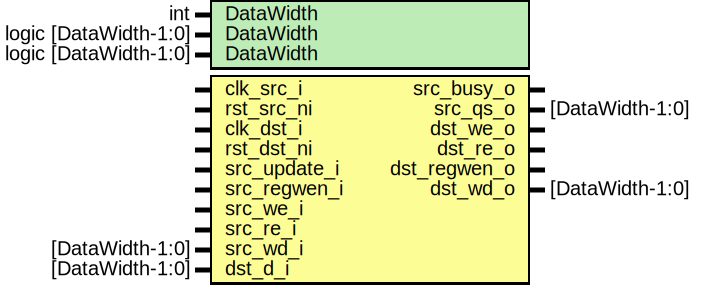

# Entity: prim_reg_cdc

- **File**: prim_reg_cdc.sv
## Diagram

## Description

 Copyright lowRISC contributors.
 Licensed under the Apache License, Version 2.0, see LICENSE for details.
 SPDX-License-Identifier: Apache-2.0

 Component handling register CDC

## Generics

| Generic name | Type                  | Value        | Description |
| ------------ | --------------------- | ------------ | ----------- |
| DataWidth    | int                   | 32           |             |
| DataWidth    | logic [DataWidth-1:0] | 32'h0        |             |
| DataWidth    | logic [DataWidth-1:0] | 32'hFFFFFFFF |             |
## Ports

| Port name    | Direction | Type            | Description |
| ------------ | --------- | --------------- | ----------- |
| clk_src_i    | input     |                 |             |
| rst_src_ni   | input     |                 |             |
| clk_dst_i    | input     |                 |             |
| rst_dst_ni   | input     |                 |             |
| src_update_i | input     |                 |             |
| src_regwen_i | input     |                 |             |
| src_we_i     | input     |                 |             |
| src_re_i     | input     |                 |             |
| src_wd_i     | input     | [DataWidth-1:0] |             |
| src_busy_o   | output    |                 |             |
| src_qs_o     | output    | [DataWidth-1:0] |             |
| dst_d_i      | input     | [DataWidth-1:0] |             |
| dst_we_o     | output    |                 |             |
| dst_re_o     | output    |                 |             |
| dst_regwen_o | output    |                 |             |
| dst_wd_o     | output    | [DataWidth-1:0] |             |
## Signals

| Name       | Type                  | Description                                                                                                                                                                                                                                                                                                                                                                                                                                                                                                                                                                                                                                                                                                                                                                                                                                                                                                                                                                            |
| ---------- | --------------------- | -------------------------------------------------------------------------------------------------------------------------------------------------------------------------------------------------------------------------------------------------------------------------------------------------------------------------------------------------------------------------------------------------------------------------------------------------------------------------------------------------------------------------------------------------------------------------------------------------------------------------------------------------------------------------------------------------------------------------------------------------------------------------------------------------------------------------------------------------------------------------------------------------------------------------------------------------------------------------------------- |
| src_ack    | logic                 |                                                                                                                                                                                                                                                                                                                                                                                                                                                                                                                                                                                                                                                                                                                                                                                                                                                                                                                                                                                        |
| src_busy_q | logic                 |                                                                                                                                                                                                                                                                                                                                                                                                                                                                                                                                                                                                                                                                                                                                                                                                                                                                                                                                                                                        |
| src_q      | logic [DataWidth-1:0] |                                                                                                                                                                                                                                                                                                                                                                                                                                                                                                                                                                                                                                                                                                                                                                                                                                                                                                                                                                                        |
| txn_bits_q | logic [TxnWidth-1:0]  |                                                                                                                                                                                                                                                                                                                                                                                                                                                                                                                                                                                                                                                                                                                                                                                                                                                                                                                                                                                        |
| src_req    | logic                 |                                                                                                                                                                                                                                                                                                                                                                                                                                                                                                                                                                                                                                                                                                                                                                                                                                                                                                                                                                                        |
| busy       | logic                 |  src_q acts as both the write holding register and the software read back  register.  When software performs a write, the write data is captured in src_q for  CDC purposes.  When not performing a write, the src_q periodically  samples the destination domain using the src_update_i indication.   To resolve software and hardware conflicts, the process is as follows:  When software issues a write, this module asserts "busy".  While busy,  src_q does not sample the destination value.  Since the  logic has committed to updating based on software command, there is an irreversible  window from which hardware writes are ignored.  Once the busy window completes,  the cdc portion then begins sampling once more.   This is consistent with prim_subreg_arb where during software / hardware conflicts,  software is always prioritized.  The main difference is the conflict resolution window  is now larger instead of just one destination clock cycle.  |
| unused_wd  | logic                 |  reserved bits are not used                                                                                                                                                                                                                                                                                                                                                                                                                                                                                                                                                                                                                                                                                                                                                                                                                                                                                                                                                            |
| dst_req    | logic                 | //////////////////////////  CDC handling //////////////////////////                                                                                                                                                                                                                                                                                                                                                                                                                                                                                                                                                                                                                                                                                                                                                                                                                                                                                                                    |
| async_flag | logic                 |                                                                                                                                                                                                                                                                                                                                                                                                                                                                                                                                                                                                                                                                                                                                                                                                                                                                                                                                                                                        |
## Constants

| Name     | Type | Value | Description                                                           |
| -------- | ---- | ----- | --------------------------------------------------------------------- |
| TxnWidth | int  | 3     | //////////////////////////  Source domain //////////////////////////  |
## Processes
- unnamed: ( @(posedge clk_src_i or negedge rst_src_ni) )
  - **Type:** always_ff
 **Description**
 busy indication back-pressures upstream if the register is accessed  again.  The busy indication is also used as a "commit" indication for  resolving software and hardware write conflicts 
- unnamed: ( @(posedge clk_src_i or negedge rst_src_ni) )
  - **Type:** always_ff
- unnamed: ( @(posedge src_req or posedge dst_ )
  - **Type:** always_ff
## Instantiations

- u_prim_sync: prim_sync_reqack
