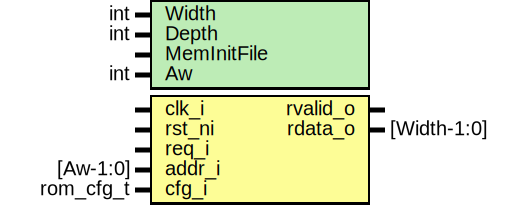

# Entity: prim_rom_adv

- **File**: prim_rom_adv.sv
## Diagram

## Description

Copyright lowRISC contributors.
 Licensed under the Apache License, Version 2.0, see LICENSE for details.
 SPDX-License-Identifier: Apache-2.0
 ROM wrapper with rvalid register
 
## Generics

| Generic name | Type | Value         | Description                                  |
| ------------ | ---- | ------------- | -------------------------------------------- |
| Width        | int  | 32            | Parameters passed on the the ROM primitive.  |
| Depth        | int  | 2048          | 8kB default                                  |
| MemInitFile  |      | ""            | VMEM file to initialize the memory with      |
| Aw           | int  | $clog2(Depth) |                                              |
## Ports

| Port name | Direction | Type        | Description |
| --------- | --------- | ----------- | ----------- |
| clk_i     | input     |             |             |
| rst_ni    | input     |             |             |
| req_i     | input     |             |             |
| addr_i    | input     | [Aw-1:0]    |             |
| rvalid_o  | output    |             |             |
| rdata_o   | output    | [Width-1:0] |             |
| cfg_i     | input     | rom_cfg_t   |             |
## Constants

| Name | Type | Value         | Description |
| ---- | ---- | ------------- | ----------- |
| Aw   | int  | $clog2(Depth) |             |
## Processes
- unnamed: ( @(posedge clk_i or negedge rst_ni) )
## Instantiations

- u_prim_rom: prim_rom
