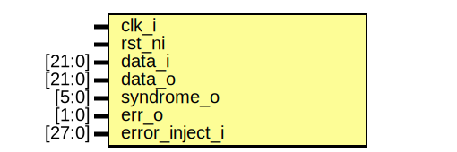

# Entity: prim_secded_28_22_assert_fpv

- **File**: prim_secded_28_22_assert_fpv.sv
## Diagram

## Description

 Copyright lowRISC contributors.
 Licensed under the Apache License, Version 2.0, see LICENSE for details.
 SPDX-License-Identifier: Apache-2.0

 SECDED FPV assertion file generated by util/design/secded_gen.py

## Ports

| Port name      | Direction | Type   | Description |
| -------------- | --------- | ------ | ----------- |
| clk_i          | input     |        |             |
| rst_ni         | input     |        |             |
| data_i         | input     | [21:0] |             |
| data_o         | input     | [21:0] |             |
| syndrome_o     | input     | [5:0]  |             |
| err_o          | input     | [1:0]  |             |
| error_inject_i | input     | [27:0] |             |
