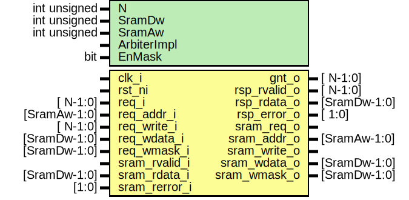

# Entity: prim_sram_arbiter

## Diagram

## Description

Copyright lowRISC contributors.
 Licensed under the Apache License, Version 2.0, see LICENSE for details.
 SPDX-License-Identifier: Apache-2.0
 N:1 SRAM arbiter
 Parameter
  N:  Number of requst port
  DW: Data width (SECDED is not included)
  Aw: Address width
  ArbiterImpl: can be either PPC or BINTREE.
 
## Generics

| Generic name | Type | Value | Description |
| ------------ | ---- | ----- | ----------- |
| N            | int  | 4     |             |
| SramDw       | int  | 32    |             |
| SramAw       | int  | 12    |             |
| ArbiterImpl  |      | "PPC" |             |
## Ports

| Port name     | Direction | Type         | Description    |
| ------------- | --------- | ------------ | -------------- |
| clk_i         | input     |              |                |
| rst_ni        | input     |              |                |
| req_i         | input     | [     N-1:0] |                |
| req_addr_i    | input     | [SramAw-1:0] |                |
| req_write_i   | input     |              |                |
| req_wdata_i   | input     | [SramDw-1:0] |                |
| gnt_o         | output    | [     N-1:0] |                |
| rsp_rvalid_o  | output    | [     N-1:0] | Pulse          |
| rsp_rdata_o   | output    | [SramDw-1:0] |                |
| rsp_error_o   | output    | [       1:0] |                |
| sram_req_o    | output    |              | SRAM Interface |
| sram_addr_o   | output    | [SramAw-1:0] |                |
| sram_write_o  | output    |              |                |
| sram_wdata_o  | output    | [SramDw-1:0] |                |
| sram_rvalid_i | input     |              |                |
| sram_rdata_i  | input     | [SramDw-1:0] |                |
| sram_rerror_i | input     | [1:0]        |                |
## Signals

| Name        | Type          | Description                    |
| ----------- | ------------- | ------------------------------ |
| req_packed  | req_t         |                                |
| sram_packed | req_t         |                                |
| steer       | logic [N-1:0] | Steering sram_rvalid_i         |
| sram_ack    | logic         | Ack for rvalid. |sram_rvalid_i |
## Constants

| Name   | Type | Value        | Description |
| ------ | ---- | ------------ | ----------- |
| ARB_DW | int  | $bits(req_t) |             |
## Types

| Name  | Type                                                                                                                                                                                                                                            | Description |
| ----- | ----------------------------------------------------------------------------------------------------------------------------------------------------------------------------------------------------------------------------------------------- | ----------- |
| req_t | struct packed {      logic write;      logic [SramAw-1:0] addr;      logic [SramDw-1:0] wdata;    } |             |
## Instantiations

- u_req_fifo: prim_fifo_sync
**Description**
Request FIFO

