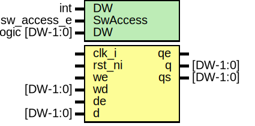

# Entity: prim_subreg

- **File**: prim_subreg.sv
## Diagram

## Description

Copyright lowRISC contributors.
 Licensed under the Apache License, Version 2.0, see LICENSE for details.
 SPDX-License-Identifier: Apache-2.0
 Register slice conforming to Comportibility guide.
 
## Generics

| Generic name | Type           | Value | Description                     |
| ------------ | -------------- | ----- | ------------------------------- |
| DW           | int            | 32    |                                 |
| SWACCESS     |                | "RW"  | {RW, RO, WO, W1C, W1S, W0C, RC} |
| DW           | logic [DW-1:0] | '0    | Reset value                     |
## Ports

| Port name | Direction | Type     | Description                                                                               |
| --------- | --------- | -------- | ----------------------------------------------------------------------------------------- |
| clk_i     | input     |          |                                                                                           |
| rst_ni    | input     |          |                                                                                           |
| we        | input     |          | From SW: valid for RW, WO, W1C, W1S, W0C, RCIn case of RC, Top connects Read Pulse to we  |
| wd        | input     | [DW-1:0] |                                                                                           |
| de        | input     |          | From HW: valid for HRW, HWO                                                               |
| d         | input     | [DW-1:0] |                                                                                           |
| qe        | output    |          | output to HW and Reg Read                                                                 |
| q         | output    | [DW-1:0] |                                                                                           |
| qs        | output    | [DW-1:0] |                                                                                           |
## Signals

| Name    | Type           | Description |
| ------- | -------------- | ----------- |
| wr_en   | logic          |             |
| wr_data | logic [DW-1:0] |             |
## Processes
- unnamed: ( @(posedge clk_i or negedge rst_ni) )
- unnamed: ( @(posedge clk_i or negedge rst_ni) )
## Instantiations

- wr_en_data_arb: prim_subreg_arb
