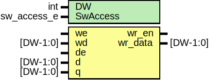

# Entity: prim_subreg_arb

- **File**: prim_subreg_arb.sv
## Diagram

## Description

 Copyright lowRISC contributors.
 Licensed under the Apache License, Version 2.0, see LICENSE for details.
 SPDX-License-Identifier: Apache-2.0

 Write enable and data arbitration logic for register slice conforming to Comportibility guide.

## Generics

| Generic name | Type        | Value      | Description |
| ------------ | ----------- | ---------- | ----------- |
| DW           | int         | 32         |             |
| SwAccess     | sw_access_e | SwAccessRW |             |
## Ports

| Port name | Direction | Type     | Description                                                                                   |
| --------- | --------- | -------- | --------------------------------------------------------------------------------------------- |
| we        | input     |          |  From SW: valid for RW, WO, W1C, W1S, W0C, RC. In case of RC, top connects read pulse to we.  |
| wd        | input     | [DW-1:0] |                                                                                               |
| de        | input     |          |  From HW: valid for HRW, HWO.                                                                 |
| d         | input     | [DW-1:0] |                                                                                               |
| q         | input     | [DW-1:0] |  From register: actual reg value.                                                             |
| wr_en     | output    |          |  To register: actual write enable and write data.                                             |
| wr_data   | output    | [DW-1:0] |                                                                                               |
## Signals

| Name     | Type           | Description                                           |
| -------- | -------------- | ----------------------------------------------------- |
| unused_q | logic [DW-1:0] |  SW higher priority  Unused q - Prevent lint errors.  |
| else     | end            |                                                       |
