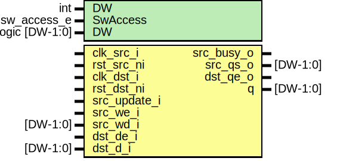

# Entity: prim_subreg_async

- **File**: prim_subreg_async.sv
## Diagram

## Description

 Copyright lowRISC contributors.
 Licensed under the Apache License, Version 2.0, see LICENSE for details.
 SPDX-License-Identifier: Apache-2.0

 Asynchronous implementation of prim_subreg

## Generics

| Generic name | Type           | Value      | Description   |
| ------------ | -------------- | ---------- | ------------- |
| DW           | int            | 32         |               |
| SwAccess     | sw_access_e    | SwAccessRW |               |
| DW           | logic [DW-1:0] | '0         |  Reset value  |
## Ports

| Port name    | Direction | Type     | Description                                                                                 |
| ------------ | --------- | -------- | ------------------------------------------------------------------------------------------- |
| clk_src_i    | input     |          |                                                                                             |
| rst_src_ni   | input     |          |                                                                                             |
| clk_dst_i    | input     |          |                                                                                             |
| rst_dst_ni   | input     |          |                                                                                             |
| src_update_i | input     |          |  destination sample pulse                                                                   |
| src_we_i     | input     |          |  From SW: valid for RW, WO, W1C, W1S, W0C, RC In case of RC, Top connects Read Pulse to we  |
| src_wd_i     | input     | [DW-1:0] |                                                                                             |
| dst_de_i     | input     |          |  From HW: valid for HRW, HWO                                                                |
| dst_d_i      | input     | [DW-1:0] |                                                                                             |
| src_busy_o   | output    |          |  output to Reg Read                                                                         |
| src_qs_o     | output    | [DW-1:0] |                                                                                             |
| dst_qe_o     | output    |          |  output to HW read                                                                          |
| q            | output    | [DW-1:0] |  This output does not follow comportable convention to work with current DV assumptions.    |
## Signals

| Name      | Type           | Description |
| --------- | -------------- | ----------- |
| dst_we    | logic          |             |
| dst_wdata | logic [DW-1:0] |             |
| q_int     | logic [DW-1:0] |             |
## Instantiations

- u_reg_cdc: prim_subreg_cdc
- u_subreg: prim_subreg
