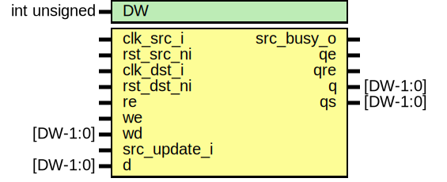

# Entity: prim_subreg_ext_async

- **File**: prim_subreg_ext_async.sv
## Diagram

## Description

 Copyright lowRISC contributors.
 Licensed under the Apache License, Version 2.0, see LICENSE for details.
 SPDX-License-Identifier: Apache-2.0

 Asynchronous implementation of prim_subreg_ext

## Generics

| Generic name | Type         | Value | Description |
| ------------ | ------------ | ----- | ----------- |
| DW           | int unsigned | 32    |             |
## Ports

| Port name    | Direction | Type     | Description                    |
| ------------ | --------- | -------- | ------------------------------ |
| clk_src_i    | input     |          |                                |
| rst_src_ni   | input     |          |                                |
| clk_dst_i    | input     |          |                                |
| rst_dst_ni   | input     |          |                                |
| re           | input     |          |  source domain signals         |
| we           | input     |          |                                |
| wd           | input     | [DW-1:0] |                                |
| src_update_i | input     |          |                                |
| src_busy_o   | output    |          |                                |
| d            | input     | [DW-1:0] |  destination domain signals    |
| qe           | output    |          |  outputs to destination domain |
| qre          | output    |          |                                |
| q            | output    | [DW-1:0] |                                |
| qs           | output    | [DW-1:0] |  outputs to source domain      |
## Signals

| Name          | Type           | Description |
| ------------- | -------------- | ----------- |
| dst_req       | logic          |             |
| dst_wdata     | logic [DW-1:0] |             |
| dst_we        | logic          |             |
| unused_src_we | logic          |             |
## Instantiations

- u_reg_cdc: prim_subreg_cdc
**Description**
 Capture both data and write-enable
 write enable is needed to determine whether qe or qre should be generated
 in the desitnation domain.

