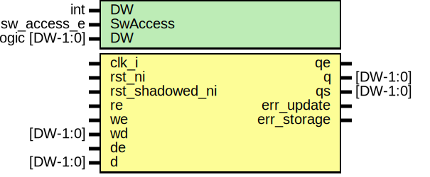

# Entity: prim_subreg_shadow
## Diagram

## Description
Copyright lowRISC contributors.
 Licensed under the Apache License, Version 2.0, see LICENSE for details.
 SPDX-License-Identifier: Apache-2.0
 Shadowed register slice conforming to Comportibility guide.
 
## Generics
| Generic name | Type           | Value | Description                     |
| ------------ | -------------- | ----- | ------------------------------- |
| DW           | int            | 32    |                                 |
| SWACCESS     |                | "RW"  | {RW, RO, WO, W1C, W1S, W0C, RC} |
| DW           | logic [DW-1:0] | '0    | reset value                     |
## Ports
| Port name   | Direction | Type     | Description                                                                               |
| ----------- | --------- | -------- | ----------------------------------------------------------------------------------------- |
| clk_i       | input     |          |                                                                                           |
| rst_ni      | input     |          |                                                                                           |
| re          | input     |          | From SW: valid for RW, WO, W1C, W1S, W0C, RC.SW reads clear phase unless SWACCESS is RO.  |
| we          | input     |          | In case of RC, top connects read pulse to we.                                             |
| wd          | input     | [DW-1:0] |                                                                                           |
| de          | input     |          | From HW: valid for HRW, HWO.                                                              |
| d           | input     | [DW-1:0] |                                                                                           |
| qe          | output    |          | Output to HW and Reg Read                                                                 |
| q           | output    | [DW-1:0] |                                                                                           |
| qs          | output    | [DW-1:0] |                                                                                           |
| err_update  | output    |          | Error conditions                                                                          |
| err_storage | output    |          |                                                                                           |
## Signals
| Name         | Type           | Description                                                                                              |
| ------------ | -------------- | -------------------------------------------------------------------------------------------------------- |
| phase_clear  | logic          | Subreg control signals                                                                                   |
| phase_q      | logic          |                                                                                                          |
| staged_we    | logic          |                                                                                                          |
| shadow_we    | logic          |                                                                                                          |
| committed_we | logic          |                                                                                                          |
| staged_de    | logic          |                                                                                                          |
| shadow_de    | logic          |                                                                                                          |
| committed_de | logic          |                                                                                                          |
| staged_qe    | logic          | Subreg status and data signals                                                                           |
| shadow_qe    | logic          | Subreg status and data signals                                                                           |
| committed_qe | logic          | Subreg status and data signals                                                                           |
| staged_q     | logic [DW-1:0] |                                                                                                          |
| shadow_q     | logic [DW-1:0] |                                                                                                          |
| committed_q  | logic [DW-1:0] |                                                                                                          |
| committed_qs | logic [DW-1:0] |                                                                                                          |
| wr_en        | logic          | Effective write enable and write data signals. These depend on we, de and wd, d, q as well as SWACCESS.  |
| wr_data      | logic [DW-1:0] |                                                                                                          |
## Processes
- phase_reg: _( @(posedge clk_i or negedge rst_ni) )_
Phase tracker:
- Reads from SW clear the phase back to 0.
- Writes have priority (can come from SW or HW).

**Description**
Phase tracker:
- Reads from SW clear the phase back to 0.
- Writes have priority (can come from SW or HW).

## Instantiations
- wr_en_data_arb: prim_subreg_arb
- staged_reg: prim_subreg
- shadow_reg: prim_subreg
- committed_reg: prim_subreg
