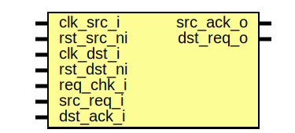

# Entity: prim_sync_reqack

## Diagram

## Description

Copyright lowRISC contributors.
 Licensed under the Apache License, Version 2.0, see LICENSE for details.
 SPDX-License-Identifier: Apache-2.0
 REQ/ACK synchronizer
 This module synchronizes a REQ/ACK handshake across a clock domain crossing.
 Both domains will see a handshake with the duration of one clock cycle.
 Notes:
 - Once asserted, the source (SRC) domain is not allowed to de-assert REQ without ACK.
 - The destination (DST) domain is not allowed to send an ACK without a REQ.
 - This module works both when syncing from a faster to a slower clock domain and vice versa.
 - Internally, this module uses a non-return-to-zero, two-phase handshake protocol. Assuming the
   DST domain responds with an ACK immediately, the latency from asserting the REQ in the
   SRC domain is:
   - 1 source + 2 destination clock cycles until the handshake is performed in the DST domain,
   - 1 source + 2 destination + 1 destination + 2 source clock cycles until the handshake is
     performed in the SRC domain.
 For further information, see Section 8.2.4 in H. Kaeslin, "Top-Down Digital VLSI Design: From
 Architecture to Gate-Level Circuits and FPGAs", 2015.
 
## Generics

| Generic name | Type | Value | Description                                                            |
| ------------ | ---- | ----- | ---------------------------------------------------------------------- |
| EnReqStabA   | bit  | 1     | Non-functional parameter to switch on the request stability assertion  |
## Ports

| Port name  | Direction | Type | Description          |
| ---------- | --------- | ---- | -------------------- |
| clk_src_i  | input     |      | REQ side, SRC domain |
| rst_src_ni | input     |      | REQ side, SRC domain |
| clk_dst_i  | input     |      | ACK side, DST domain |
| rst_dst_ni | input     |      | ACK side, DST domain |
| src_req_i  | input     |      | REQ side, SRC domain |
| src_ack_o  | output    |      | REQ side, SRC domain |
| dst_req_o  | output    |      | ACK side, DST domain |
| dst_ack_i  | input     |      | ACK side, DST domain |
## Signals

| Name          | Type              | Description |
| ------------- | ----------------- | ----------- |
| src_fsm_ns    | sync_reqack_fsm_e |             |
| src_fsm_cs    | sync_reqack_fsm_e |             |
| dst_fsm_ns    | sync_reqack_fsm_e |             |
| dst_fsm_cs    | sync_reqack_fsm_e |             |
| src_req_d     | logic             |             |
| src_req_q     | logic             |             |
| src_ack       | logic             |             |
| dst_ack_d     | logic             |             |
| dst_ack_q     | logic             |             |
| dst_req       | logic             |             |
| src_handshake | logic             |             |
| dst_handshake | logic             |             |
## Types

| Name              | Type                           | Description |
| ----------------- | ------------------------------ | ----------- |
| sync_reqack_fsm_e | enum logic {     EVEN, ODD   } | Types       |
## Processes
- src_fsm: (  )
**Description**
REQ-side FSM (SRC domain)

- dst_fsm: (  )
**Description**
ACK-side FSM (DST domain)

- unnamed: ( @(posedge clk_src_i or negedge rst_src_ni) )
**Description**
Registers

- unnamed: ( @(posedge clk_dst_i or negedge rst_dst_ni) )
## Instantiations

- req_sync: prim_flop_2sync
**Description**
Move REQ over to DST domain.

- ack_sync: prim_flop_2sync
**Description**
Move ACK over to SRC domain.

