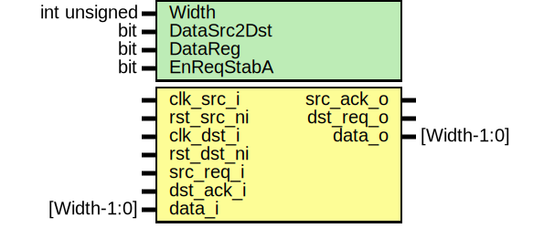

# Entity: prim_sync_reqack_data

- **File**: prim_sync_reqack_data.sv
## Diagram

## Description

 Copyright lowRISC contributors.
 Licensed under the Apache License, Version 2.0, see LICENSE for details.
 SPDX-License-Identifier: Apache-2.0

 REQ/ACK synchronizer with associated data.

 This module synchronizes a REQ/ACK handshake with associated data across a clock domain
 crossing (CDC). Both domains will see a handshake with the duration of one clock cycle. By
 default, the data itself is not registered. The main purpose of feeding the data through this
 module to have an anchor point for waiving CDC violations. If the data is configured to flow
 from the destination (DST) to the source (SRC) domain, an additional register stage can be
 inserted for data buffering.

 Under the hood, this module uses a prim_sync_reqack primitive for synchronizing the
 REQ/ACK handshake. See prim_sync_reqack.sv for more details.

## Generics

| Generic name | Type         | Value | Description                                  |
| ------------ | ------------ | ----- | -------------------------------------------- |
| Width        | int unsigned | 1     |                                              |
| DataSrc2Dst  | bit          | 1'b1  |  Direction of data flow: 1'b1 = SRC to DST,  |
| DataReg      | bit          | 1'b0  |  Enable optional register stage for data,    |
## Ports

| Port name  | Direction | Type        | Description                                                     |
| ---------- | --------- | ----------- | --------------------------------------------------------------- |
| clk_src_i  | input     |             | REQ side, SRC domain                                            |
| rst_src_ni | input     |             | REQ side, SRC domain                                            |
| clk_dst_i  | input     |             | ACK side, DST domain                                            |
| rst_dst_ni | input     |             | ACK side, DST domain                                            |
| req_chk_i  | input     |             | Used for gating assertions. Drive to 1 during normal operation. |
| src_req_i  | input     |             | REQ side, SRC domain                                            |
| src_ack_o  | output    |             | REQ side, SRC domain                                            |
| dst_req_o  | output    |             | ACK side, DST domain                                            |
| dst_ack_i  | input     |             | ACK side, DST domain                                            |
| data_i     | input     | [Width-1:0] |                                                                 |
| data_o     | output    | [Width-1:0] |                                                                 |
## Instantiations

- u_prim_sync_reqack: prim_sync_reqack
 **Description**
//////////////////////////////////
 REQ/ACK synchronizer primitive //
//////////////////////////////////

