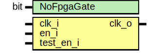

# Entity: prim_xilinx_clock_gating

- **File**: prim_xilinx_clock_gating.sv
## Diagram

## Description

Copyright lowRISC contributors.
 Licensed under the Apache License, Version 2.0, see LICENSE for details.
 SPDX-License-Identifier: Apache-2.0
 
## Generics

| Generic name | Type | Value | Description |
| ------------ | ---- | ----- | ----------- |
| NoFpgaGate   | bit  | 1'b0  |             |
## Ports

| Port name | Direction | Type | Description |
| --------- | --------- | ---- | ----------- |
| clk_i     | input     |      |             |
| en_i      | input     |      |             |
| test_en_i | input     |      |             |
| clk_o     | output    |      |             |
