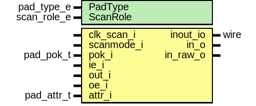

# Entity: prim_xilinx_pad_wrapper

- **File**: prim_xilinx_pad_wrapper.sv
## Diagram

## Description

 Copyright lowRISC contributors.
 Licensed under the Apache License, Version 2.0, see LICENSE for details.
 SPDX-License-Identifier: Apache-2.0

 Bidirectional IO buffer for Xilinx FPGAs. Implements inversion and
 virtual open drain feature.

## Generics

| Generic name | Type        | Value    | Description                                            |
| ------------ | ----------- | -------- | ------------------------------------------------------ |
| PadType      | pad_type_e  | BidirStd |  These parameters are ignored in this Xilinx variant.  |
| ScanRole     | scan_role_e | NoScan   |                                                        |
## Ports

| Port name  | Direction | Type       | Description                                                       |
| ---------- | --------- | ---------- | ----------------------------------------------------------------- |
| clk_scan_i | input     |            |  This is only used for scanmode (not used in this Xilinx variant) |
| scanmode_i | input     |            |                                                                   |
| pok_i      | input     | pad_pok_t  |  Power sequencing signals (not used in this Xilinx variant)       |
| inout_io   | inout     | wire       | bidirectional pad                                                 |
| in_o       | output    |            | input data                                                        |
| in_raw_o   | output    |            | uninverted output data                                            |
| ie_i       | input     |            | input enable                                                      |
| out_i      | input     |            | output data                                                       |
| oe_i       | input     |            | output enable                                                     |
| attr_i     | input     | pad_attr_t | additional pad attributes                                         |
## Signals

| Name        | Type  | Description                      |
| ----------- | ----- | -------------------------------- |
| unused_sigs | logic |  not all signals are used here.  |
