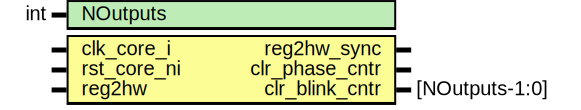

# Entity: pwm_cdc

## Diagram

## Description

Copyright lowRISC contributors.
 Licensed under the Apache License, Version 2.0, see LICENSE for details.
 SPDX-License-Identifier: Apache-2.0
 Description: CDC for PWM
 
## Generics

| Generic name | Type | Value | Description |
| ------------ | ---- | ----- | ----------- |
| NOutputs     | int  | 6     |             |
## Ports

| Port name      | Direction | Type           | Description |
| -------------- | --------- | -------------- | ----------- |
| clk_core_i     | input     |                |             |
| rst_core_ni    | input     |                |             |
| reg2hw         | input     |                |             |
| reg2hw_sync    | output    |                |             |
| clr_phase_cntr | output    |                |             |
| clr_blink_cntr | output    | [NOutputs-1:0] |             |
## Signals

| Name            | Type        | Description                                                                                                                          |
| --------------- | ----------- | ------------------------------------------------------------------------------------------------------------------------------------ |
| common_sync_in  | wire [31:0] |                                                                                                                                      |
| common_sync_out | wire [31:0] |                                                                                                                                      |
| common_sync_q   | reg [31:0]  |                                                                                                                                      |
| unused_regen    | logic       | All fields in reg2hw are synced across the CDC except REGEN (the register write enable) and ALERT_TEST. Explicitly waive them here.  |
| unused_reg      | logic       | unused register configuration                                                                                                        |
## Processes
- unnamed: ( @(posedge clk_core_i or negedge rst_core_ni) )
## Instantiations

- u_common_sync1: prim_flop_2sync
