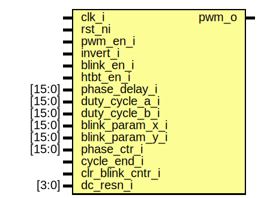

# Entity: pwm_chan
## Diagram

## Description
Copyright lowRISC contributors.
 Licensed under the Apache License, Version 2.0, see LICENSE for details.
 SPDX-License-Identifier: Apache-2.0
 
## Ports
| Port name        | Direction | Type   | Description |
| ---------------- | --------- | ------ | ----------- |
| clk_i            | input     |        |             |
| rst_ni           | input     |        |             |
| pwm_en_i         | input     |        |             |
| invert_i         | input     |        |             |
| blink_en_i       | input     |        |             |
| htbt_en_i        | input     |        |             |
| phase_delay_i    | input     | [15:0] |             |
| duty_cycle_a_i   | input     | [15:0] |             |
| duty_cycle_b_i   | input     | [15:0] |             |
| blink_param_x_i  | input     | [15:0] |             |
| blink_param_y_i  | input     | [15:0] |             |
| phase_ctr_i      | input     | [15:0] |             |
| cycle_end_i      | input     |        |             |
| clr_blink_cntr_i | input     |        |             |
| dc_resn_i        | input     | [3:0]  |             |
| pwm_o            | output    |        |             |
## Signals
| Name               | Type         | Description          |
| ------------------ | ------------ | -------------------- |
| duty_cycle_actual  | logic [15:0] |                      |
| on_phase           | logic [15:0] |                      |
| off_phase          | logic [15:0] |                      |
| phase_wrap         | logic        |                      |
| pwm_int            | logic        |                      |
| blink_ctr_q        | logic [15:0] | Standard blink mode  |
| blink_ctr_d        | logic [15:0] |                      |
| duty_cycle_blink   | logic [15:0] |                      |
| htbt_ctr_q         | logic [15:0] | Heartbeat mode       |
| htbt_ctr_d         | logic [15:0] |                      |
| duty_cycle_htbt    | logic [15:0] |                      |
| dc_htbt_d          | logic [15:0] |                      |
| dc_htbt_q          | logic [15:0] |                      |
| dc_htbt_end        | logic        |                      |
| htbt_direction     | logic        |                      |
| dc_wrap            | logic        |                      |
| pos_htbt           | logic        |                      |
| neg_htbt           | logic        |                      |
| pattern_repeat     | logic        |                      |
| phase_delay_scaled | logic [15:0] |                      |
| duty_cycle_scaled  | logic [15:0] |                      |
| on_phase_exceeded  | logic        |                      |
| off_phase_exceeded | logic        |                      |
## Processes
- unnamed: _( @(posedge clk_i or negedge rst_ni) )_

- unnamed: _( @(posedge clk_i or negedge rst_ni) )_

- unnamed: _( @(posedge clk_i or negedge rst_ni) )_

- unnamed: _( @(posedge clk_i or negedge rst_ni) )_

